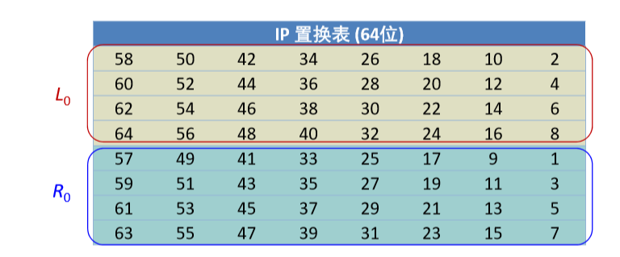
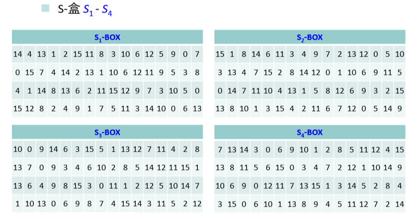
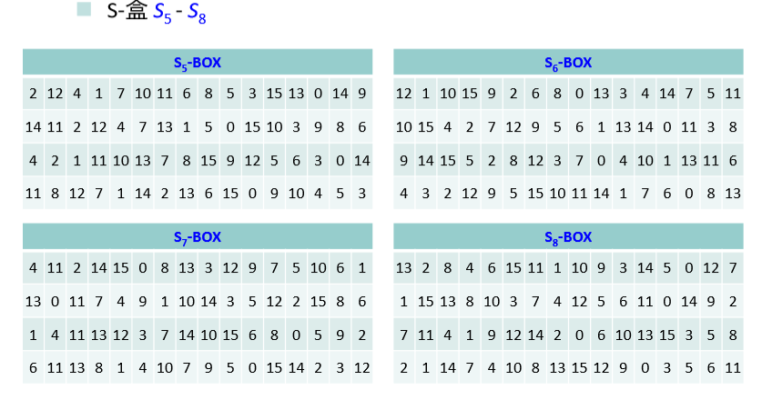
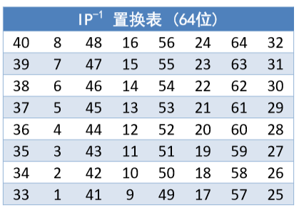
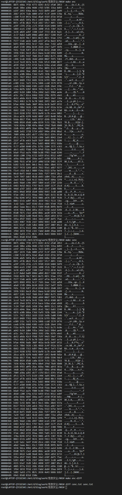
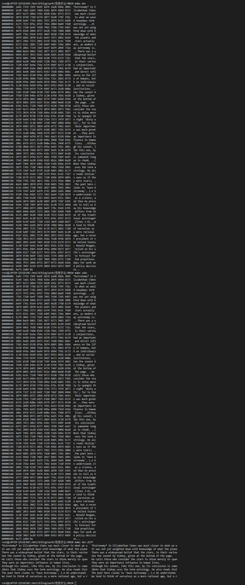

# DES 算法报告

- 米家龙
- 18342075
- 数据科学与计算机学院

## 目录

- [DES 算法报告](#des-算法报告)
  - [目录](#目录)
  - [算法原理总综述](#算法原理总综述)
    - [加密](#加密)
      - [填充](#填充)
      - [子密钥生成](#子密钥生成)
      - [块加密](#块加密)
        - [初始置换](#初始置换)
        - [迭代](#迭代)
          - [轮函数](#轮函数)
        - [交换置换](#交换置换)
        - [IP 逆置换](#ip-逆置换)
    - [解密](#解密)
  - [总体架构](#总体架构)
  - [数据结构设计](#数据结构设计)
  - [模块分解](#模块分解)
  - [C语言代码](#c语言代码)
  - [编译运行结果](#编译运行结果)

## 算法原理总综述

> 本次采用的是 des-ecb 加密算法，因此是对一个8字节的块进行加密，并且需要进行填充

### 加密

#### 填充

**填充**采用的是 PKCS#5 规范进行字节填充：
- 当原始明文最后分组不足8字节，则填满至8字节，填充的值为**需要填充的字节牧户**
- 如果原始明文分组完全，则需要额外增加一个分组，每个字节的值都是0x08

#### 子密钥生成

1. 获取给定的64位密钥*K*
2. 使用**PC-1置换表**进行置换，得到56位的$C_{0}D_{0}$ ，$C_0$和$D_0$分别由置换结果的前28位和后28位组成
3. 对一下操作进行16次循环，生成子密钥$K_{1} - K_{16}$：
   1. 计算子$C_{i}D_{i}$：$C_{i} = LS_{i}(C_{i - 1})$ ，$D_{i} = LS_{i}(D_{i - 1})$ ，$LS$ 代表循环左移，当$i = 1, 2, 9, 16$时，**循环左移一位**；否则**循环左移两位**
   2. 对$C_{i}D_{i}$进行**PC-2置换**，压缩成48位，得到对应的子密钥$K_i$
   3. $i = i + 1$

#### 块加密

> 基于上述分组和填充后，对每个8字节的块进行块加密

##### 初始置换

基于下图对8字节的块（共64位）进行初始置换，途中置换表中数字对应的原始64位的下标编号序列



> 由于该下标编号序列是1到64，因此在直接使用时需要-1，用于匹配数组的下标

##### 迭代

根据初始置换，得到了$L_{0}R_{0}$，以该数组为基础，进行16次迭代，下面列表表示一次迭代：
- $L_{i} = R_{i - 1}$
- $R_{i} = L_{i - 1} \bigoplus f(R_{i -1}, K{i})$
- $i = i + 1$
- 其中$f$是轮函数，输出一个32位数组；$\bigoplus$是32位二进制串按位**异或**

###### 轮函数

> 轮函数接受32位的输入，并且返回一个32位的输出

具体步骤如下：
1. 将长度为32位的串 $R_{i - 1}$ 作 **E-扩展**，得到一个48位的串 $E(R_{i - 1})$
2. 将 $E(R_{i - 1})$ 和长度为48位的子密钥 $K_i$ 作48位二进制串**按位异或**运算，$K_i$ 由密钥 K 生成
3. 将上一步得到的结果平均分成8个分组，每个分组长度6位。各个分组分别经过8个不同的**S-盒**进行6-4 转换，得到8个长度分别为4位的分组，具体转换操作如下：
   - S-盒是一类选择函数，用于二进制**6-4转换**。Feistel轮函数使用8个S-盒 $S_1, \cdots, S_8$ ，每个S-盒是一个4行(编号十进制数 0-3)、16列(编号十进制数 0-15) 的二维表，表中每个元素是一个十进制数，取值在 0-15 之间，用于表示一个4位二进制数。
   - 假设Si 的6位二进制输入为 $b_1b_2b_3b_4b_5b_6$ ，则由 $n = (b_1b_6)_{10}$ 确定行号，由 $m = (b_2b_3b_4b_5)_{10}$ 确定列号，$S_i[n, m]$ 元素的值 的二进制形式即为所要的 $S_i$ 的输出。
4. 将第3步得到的分组结果顺序连接得到长度为32位的串
5. 将上一步的结果经过**P-置换**，得到的结果作为轮函数 $f(R_{i-1}, K_i)$ 的最终32位输出。

S-盒如图：





##### 交换置换

将迭代结果得到的 $L_{16}R_{16}$ 进行交换，即得到结果 $R_{16}L_{16}$

##### IP 逆置换

根据 IP 逆置换表（由 IP 置换表变换而来），进行置换，得到加密结果，逆置换表如下：



### 解密

> 解密没有补全，其余基本和加密一样，剩下的唯一区别是：
>
> 使用轮函数进行迭代时，是倒序使用子密钥，即从 $K_{16}$ 到 $K_1$ 进行引用

## 总体架构

- 主函数：
  - 获取密钥，并且生成子密钥
  - 根据参数加载功能：
    - 加密功能（需要设置一个 flag 判断是否已经补全）：
      1. 以8字节为单位，进行文件块读取，如果需要补全，则 `flag = true`
      2. 对上面获取的块进行加密：
         1. 初始置换
         2. 使用轮函数进行16次迭代
         3. 交换置换
         4. IP逆置换
         5. 输出
      3. 如果 `flag == false` ，那么需要进行新增一个空块，进行补全，并按照第2步进行加密，输出；反之则不用
    - 解密功能：
      1. 以8字节为单位，进行文件块读取
      2. 对上面读取的块进行解密：
         1. 初始置换
         2. 使用轮函数进行16次迭代
         3. 交换置换
         4. IP逆置换
         5. 判断填充用于确定输出

## 数据结构设计

相关数据类型定义如下：
```cpp
#define BLOCK64 64         // 01位块长度
#define BLOCK8 9           // 8字节明文块长度，由于字符串限制，必须+1
#define EEXTAND 48         // E-拓展串
#define SUBKEYLEN 48       // 子密钥长度
#define SUBKEYNUM 16       // 子密钥数量
#define KEYLEN 64          // 密钥长度
#define NOCHECKDIGITLEN 56 // 非校验位长度

typedef bool des1_t;
typedef unsigned char des8_t;

des8_t block8[BLOCK8];           // 明文
des8_t encodedBlock8[BLOCK8];    // 加密后的明文
des1_t block64[BLOCK64];         // 二进制明文
des1_t encodedBlock64[BLOCK64];  // 加密后的二进制明文
des1_t encodingBlock64[BLOCK64]; // 加密中的二进制明文
des1_t decodedBlock64[BLOCK64];  // 解密后的二进制明文
des8_t decodedBlock8[BLOCK8];    // 解密后的明文
des1_t decodingBlock64[BLOCK64]; // 解密中的二进制明文

char InitKey[KEYLEN / 4 + 1];        // 16进制的输入
des1_t Key[BLOCK64];                 // 密钥
des1_t Subkey[SUBKEYNUM][SUBKEYLEN]; // 子密钥

FILE *readFile; // 读取的文件
```

## 模块分解

具体函数如下：
```cpp
/**
 * 通过密钥生成子密钥，总共生成16个
 * @param K des1_t* 密钥
*/
void getSubkey(des1_t *K);

/**
 * 8字节 转换成 64位
 * @param from des8_t* 源数组
 * @param to des1_t* 目标数组
*/
void block8ToBlock64(des8_t *from, des1_t *to);

/**
 * 64位 转换为 8字节
 * @param from des1_t* 源数组
 * @param to des8_t* 目标数组
*/
void block64ToBlock8(des1_t *from, des8_t *to);

/**
 * 通过初始获取的密钥进行转换
*/
void getKey();

/**
 * 轮函数
 * @param Ri des1_t*
 * @param iterationNum int 迭代次数
 * @return 一个32位数组指针
*/
des1_t *Feistel(des1_t *Ri, int iteraionNum);

/**
 * 块加密
*/
void encodeBlock();

/**
 * 块解密
*/
void decodeBlock();

/**
 * 加密
*/
void encode();

/**
 * 解密
*/
void decode();

int main(); // 主函数
```

## C语言代码

完整代码如下：
```cpp
#include <stdio.h>
#include <stdlib.h>
#include <stdbool.h>
#include <ctype.h>
#include <string.h>

#define BLOCK64 64         // 01位块长度
#define BLOCK8 9           // 8字节明文块长度，由于字符串限制，必须+1
#define EEXTAND 48         // E-拓展串
#define SUBKEYLEN 48       // 子密钥长度
#define SUBKEYNUM 16       // 子密钥数量
#define KEYLEN 64          // 密钥长度
#define NOCHECKDIGITLEN 56 // 非校验位长度

typedef bool des1_t;
typedef unsigned char des8_t;

// IP 置换表
const int IP_TABLE[BLOCK64] = {
    58, 50, 42, 34, 26, 18, 10, 2,
    60, 52, 44, 36, 28, 20, 12, 4,
    62, 54, 46, 38, 30, 22, 14, 6,
    64, 56, 48, 40, 32, 24, 16, 8,
    57, 49, 41, 33, 25, 17, 9, 1,
    59, 51, 43, 35, 27, 19, 11, 3,
    61, 53, 45, 37, 29, 21, 13, 5,
    63, 55, 47, 39, 31, 23, 15, 7};

// IP逆 置换表
const int IP_TABLE_REVERSE[BLOCK64] = {
    40, 8, 48, 16, 56, 24, 64, 32,
    39, 7, 47, 15, 55, 23, 63, 31,
    38, 6, 46, 14, 54, 22, 62, 30,
    37, 5, 45, 13, 53, 21, 61, 29,
    36, 4, 44, 12, 52, 20, 60, 28,
    35, 3, 43, 11, 51, 19, 59, 27,
    34, 2, 42, 10, 50, 18, 58, 26,
    33, 1, 41, 9, 49, 17, 57, 25};

// P-置换
const int P_TABLE[BLOCK64 / 2] = {
    16, 7, 20, 21,
    29, 12, 28, 17,
    1, 15, 23, 26,
    5, 18, 31, 10,
    2, 8, 24, 14,
    32, 27, 3, 9,
    19, 13, 30, 6,
    22, 11, 4, 25};

// PC-1 置换表
const int PC_1_TABLE[NOCHECKDIGITLEN] = {
    // C0
    57, 49, 41, 33, 25, 17, 9,
    11, 58, 50, 42, 34, 26, 18,
    10, 2, 59, 51, 43, 35, 27,
    19, 11, 3, 60, 52, 44, 36,

    // D0
    63, 55, 47, 39, 31, 23, 15,
    7, 62, 54, 46, 38, 30, 22,
    14, 6, 61, 53, 45, 37, 29,
    21, 13, 5, 28, 20, 12, 4};

// PC-2 置换表
const int PC_2_TABLE[SUBKEYLEN] = {
    14, 17, 11, 24, 1, 5,
    3, 28, 15, 6, 21, 10,
    23, 19, 12, 4, 26, 8,
    16, 7, 27, 20, 13, 2,

    41, 52, 31, 37, 47, 55,
    30, 40, 51, 45, 33, 48,
    44, 49, 39, 56, 34, 53,
    46, 42, 50, 36, 29, 32};

// S 盒
const int S_BOX[][BLOCK64] = {
    {14, 4, 13, 1, 2, 15, 11, 8, 3, 10, 6, 12, 5, 9, 0, 7,
     0, 15, 7, 4, 14, 2, 13, 1, 10, 6, 12, 11, 9, 5, 3, 8,
     4, 1, 14, 8, 13, 6, 2, 11, 15, 12, 9, 7, 3, 10, 5, 0,
     15, 12, 8, 2, 4, 9, 1, 7, 5, 11, 3, 14, 10, 0, 6, 13},

    {15, 1, 8, 14, 6, 11, 3, 4, 9, 7, 2, 13, 12, 0, 5, 10,
     3, 13, 4, 7, 15, 2, 8, 14, 12, 0, 1, 10, 6, 9, 11, 5,
     0, 14, 7, 11, 10, 4, 13, 1, 5, 8, 12, 6, 9, 3, 2, 15,
     13, 8, 10, 1, 3, 15, 4, 2, 11, 6, 7, 12, 0, 5, 14, 9},

    {10, 0, 9, 14, 6, 3, 15, 5, 1, 13, 12, 7, 11, 4, 2, 8,
     13, 7, 0, 9, 3, 4, 6, 10, 2, 8, 5, 14, 12, 11, 15, 1,
     13, 6, 4, 9, 8, 15, 3, 0, 11, 1, 2, 12, 5, 10, 14, 7,
     1, 10, 13, 0, 6, 9, 8, 7, 4, 15, 14, 3, 11, 5, 2, 12},

    {7, 13, 14, 3, 0, 6, 9, 10, 1, 2, 8, 5, 11, 12, 4, 15,
     13, 8, 11, 5, 6, 15, 0, 3, 4, 7, 2, 12, 1, 10, 14, 9,
     10, 6, 9, 0, 12, 11, 7, 13, 15, 1, 3, 14, 5, 2, 8, 4,
     3, 15, 0, 6, 10, 1, 13, 8, 9, 4, 5, 11, 12, 7, 2, 14},

    {2, 12, 4, 1, 7, 10, 11, 6, 8, 5, 3, 15, 13, 0, 14, 9,
     14, 11, 2, 12, 4, 7, 13, 1, 5, 0, 15, 10, 3, 9, 8, 6,
     4, 2, 1, 11, 10, 13, 7, 8, 15, 9, 12, 5, 6, 3, 0, 14,
     11, 8, 12, 7, 1, 14, 2, 13, 6, 15, 0, 9, 10, 4, 5, 3},

    {12, 1, 10, 15, 9, 2, 6, 8, 0, 13, 3, 4, 14, 7, 5, 11,
     10, 15, 4, 2, 7, 12, 9, 5, 6, 1, 13, 14, 0, 11, 3, 8,
     9, 14, 15, 5, 2, 8, 12, 3, 7, 0, 4, 10, 1, 13, 11, 6,
     4, 3, 2, 12, 9, 5, 15, 10, 11, 14, 1, 7, 6, 0, 8, 13},

    {4, 11, 2, 14, 15, 0, 8, 13, 3, 12, 9, 7, 5, 10, 6, 1,
     13, 0, 11, 7, 4, 9, 1, 10, 14, 3, 5, 12, 2, 15, 8, 6,
     1, 4, 11, 13, 12, 3, 7, 14, 10, 15, 6, 8, 0, 5, 9, 2,
     6, 11, 13, 8, 1, 4, 10, 7, 9, 5, 0, 15, 14, 2, 3, 12},

    {13, 2, 8, 4, 6, 15, 11, 1, 10, 9, 3, 14, 5, 0, 12, 7,
     1, 15, 13, 8, 10, 3, 7, 4, 12, 5, 6, 11, 0, 14, 9, 2,
     7, 11, 4, 1, 9, 12, 14, 2, 0, 6, 10, 13, 15, 3, 5, 8,
     2, 1, 14, 7, 4, 10, 8, 13, 15, 12, 9, 0, 3, 5, 6, 11}};

// E-拓规则（比特-选择表）
const int E_EXTAND[SUBKEYLEN] = {
    32, 1, 2, 3, 4, 5,
    4, 5, 6, 7, 8, 9,
    8, 9, 10, 11, 12, 13,
    12, 13, 14, 15, 16, 17,
    16, 17, 18, 19, 20, 21,
    20, 21, 22, 23, 24, 25,
    24, 25, 26, 27, 28, 29,
    28, 29, 30, 31, 32, 1};

des8_t block8[BLOCK8];           // 明文
des8_t encodedBlock8[BLOCK8];    // 加密后的明文
des1_t block64[BLOCK64];         // 二进制明文
des1_t encodedBlock64[BLOCK64];  // 加密后的二进制明文
des1_t encodingBlock64[BLOCK64]; // 加密中的二进制明文
des1_t decodedBlock64[BLOCK64];  // 解密后的二进制明文
des8_t decodedBlock8[BLOCK8];    // 解密后的明文
des1_t decodingBlock64[BLOCK64]; // 解密中的二进制明文

char InitKey[KEYLEN / 4 + 1];        // 16进制的输入
des1_t Key[BLOCK64];                 // 密钥
des1_t Subkey[SUBKEYNUM][SUBKEYLEN]; // 子密钥

FILE *readFile; // 读取的文件

/**
 * 通过密钥生成子密钥，总共生成16个
 * @param K des1_t* 密钥
*/
void getSubkey(des1_t *K);

/**
 * 8字节 转换成 64位
 * @param from des8_t* 源数组
 * @param to des1_t* 目标数组
*/
void block8ToBlock64(des8_t *from, des1_t *to);

/**
 * 64位 转换为 8字节
 * @param from des1_t* 源数组
 * @param to des8_t* 目标数组
*/
void block64ToBlock8(des1_t *from, des8_t *to);

/**
 * 通过初始获取的密钥进行转换
*/
void getKey();

/**
 * 轮函数
 * @param Ri des1_t*
 * @param iterationNum int 迭代次数
 * @return 一个32位数组指针
*/
des1_t *Feistel(des1_t *Ri, int iteraionNum);

/**
 * 块加密
*/
void encodeBlock();

/**
 * 块解密
*/
void decodeBlock();

/**
 * 加密
*/
void encode();

/**
 * 解密
*/
void decode();

int main(char argc, char **argv)
{
  if (argc != 4)
  {
    printf("usage: ./out [enc | dec] key filename\n");
    return 0;
  }
  else
  {
    strcpy(InitKey, argv[2]); // 获取密钥
    getKey();
    getSubkey(Key);
    readFile = fopen(argv[3], "r"); // 打开文件
    if (strcmp(argv[1], "enc") == 0)
    {
      encode();
    }
    else if (strcmp(argv[1], "dec") == 0)
    {
      decode();
    }
    fclose(readFile); // 关闭文件
  }
}

void decode()
{
  int len = 0;
  while ((len = fread(encodedBlock8, 1, 8, readFile)) != 0)
  {
    encodedBlock8[len] = 0;
    // printf("%s", encodedBlock8);
    block8ToBlock64(encodedBlock8, encodedBlock64);
    decodeBlock();
    block64ToBlock8(decodedBlock64, decodedBlock8);

    // 去除填充
    decodedBlock8[8] = 0;
    int tail = decodedBlock8[7]; // 看末尾那位是否是填充的
    bool isPadding = true;
    for (int i = 8 - tail; i < BLOCK8 - 1; i++)
    {
      if (decodedBlock8[i] != tail) // 不是填充
      {
        isPadding = false;
        break;
      }
    }

    if (isPadding)
    {
      decodedBlock8[8 - tail] = 0;
    }
    printf("%s", decodedBlock8);
  }
}

void encode()
{
  bool padding = false; // 判定是否已经补全
  int len = 0;
  while (!feof(readFile))
  {
    len = fread(block8, 1, 8, readFile);
    block8[len] = 0;
    if (len < 8)
    {
      for (int i = len; i < 8; i++)
      {
        block8[i] = 8 - len; // 填充
      }
      block8[8] = 0;
      padding = true;
    }
    block8ToBlock64(block8, block64);
    encodeBlock();
    block64ToBlock8(encodedBlock64, encodedBlock8);
    for (int i = 0; i < 8; i++)
    {
      putchar(encodedBlock8[i]);
    }
  }

  // 如果刚好输入完成，那么需要补一个块
  if (!padding)
  {
    for (int i = 0; i < 8; i++)
    {
      block8[i] = 0x08;
    }
    block8[8] = 0;
    block8ToBlock64(block8, block64);
    encodeBlock();
    block64ToBlock8(encodedBlock64, encodedBlock8);
    for (int i = 0; i < 8; i++)
    {
      putchar(encodedBlock8[i]);
    }
  }
}

void block8ToBlock64(des8_t *from, des1_t *to)
{
  for (int i = 0; i < 8; i++)
  {
    des8_t tmp = from[i];
    for (int j = 0; j < 8; j++)
    {
      to[i * 8 + j] = (tmp >> (7 - j)) & 1;
    }
  }
}

void block64ToBlock8(des1_t *from, des8_t *to)
{
  for (int i = 0; i < 8; i++)
  {
    des8_t tmp = 0;
    for (int j = 0; j < 8; j++)
    {
      tmp = (tmp << 1) + from[i * 8 + j];
    }
    to[i] = tmp;
  }
}

void encodeBlock()
{
  // 初始置换 IP
  for (int i = 0; i < BLOCK64; i++)
  {
    encodingBlock64[i] = block64[IP_TABLE[i] - 1];
  }
  // 16次迭代
  des1_t *Li = encodingBlock64;               // 初始化 L0
  des1_t *Ri = encodingBlock64 + BLOCK64 / 2; // 初始化 R0

  for (int i = 0; i < BLOCK64 / 4; i++)
  {
    des1_t *tmp = Feistel(Ri, i); // 轮函数结果
    des1_t L_tmp, R_tmp;
    for (int j = 0; j < BLOCK64 / 2; j++)
    {
      L_tmp = Ri[j];
      R_tmp = Li[j] ^ tmp[j];

      Li[j] = L_tmp;
      Ri[j] = R_tmp;
    }
  }

  // 交换置换
  for (int i = 0; i < BLOCK64 / 2; i++)
  {
    des1_t tmp = Li[i];
    Li[i] = Ri[i];
    Ri[i] = tmp;
  }
  for (int i = 0; i < BLOCK64; i++)
  {
    encodedBlock64[i] = encodingBlock64[IP_TABLE_REVERSE[i] - 1];
  }
}

des1_t *Feistel(des1_t *Ri, int iteraionNum)
{
  // E 拓展
  des1_t e_extand[48]; // E 拓展结果
  for (int i = 0; i < EEXTAND; i++)
  {
    e_extand[i] = Ri[E_EXTAND[i] - 1];
  }

  des1_t xorList[48]; // 异或的结果
  for (int i = 0; i < EEXTAND; i++)
  {
    xorList[i] = e_extand[i] ^ Subkey[iteraionNum][i];
  }

  // S 盒压缩
  des1_t s_box_res[32]; // S 盒压缩结果
  for (int i = 0; i < 8; i++)
  {
    int n = (xorList[i * 6] << 1) + xorList[i * 6 + 5];                                                             // 确定行号
    int m = (xorList[i * 6 + 1] << 3) + (xorList[i * 6 + 2] << 2) + (xorList[i * 6 + 3] << 1) + xorList[i * 6 + 4]; // 获取列号

    des8_t res = S_BOX[i][n * BLOCK64 / 4 + m];

    for (int j = 0; j < 4; j++)
    {
      s_box_res[i * 4 + j] = (res >> (3 - j)) & 1;
    }
  }

  static des1_t p_res[BLOCK64 / 2]; // P 置换的结果
  for (int i = 0; i < BLOCK64 / 2; i++)
  {
    p_res[i] = s_box_res[P_TABLE[i] - 1];
  }

  return p_res;
}

void getKey()
{
  for (int i = 0; i < 16; i++)
  {
    int moveBit = i % 2 == 0 ? 4 : 0;
    int tmp = InitKey[i] = tolower(InitKey[i]);
    if (isdigit(tmp))
    {
      tmp -= '0';
      InitKey[i] = tmp;
    }
    else
    {
      tmp -= ('a' - 10);
      InitKey[i] = tmp;
    }

    for (int j = 0; j < 4; j++)
    {
      Key[i * 4 + j] = (tmp >> (3 - j)) & 1;
    }
  }
}

void getSubkey(des1_t *K)
{

  // 进行初始的 PC-1 置换
  des1_t CD[NOCHECKDIGITLEN];
  for (int i = 0; i < NOCHECKDIGITLEN; i++)
  {
    CD[i] = K[PC_1_TABLE[i] - 1];
  }

  // 循环生成
  for (int i = 0; i < SUBKEYNUM; i++)
  {

    // 进行 LS 操作
    if (i == 0 || i == 1 || i == 8 || i == 15) // 需要循环左移1个位置
    {
      des1_t tmpC = CD[0];                   // 对 C
      des1_t tmpD = CD[NOCHECKDIGITLEN / 2]; // 对 D
      for (int j = 0; j < NOCHECKDIGITLEN / 2 - 1; j++)
      {
        CD[j] = CD[j + 1];
        CD[j + NOCHECKDIGITLEN / 2] = CD[j + NOCHECKDIGITLEN / 2 + 1];
      }
      CD[NOCHECKDIGITLEN / 2 - 1] = tmpC;
      CD[NOCHECKDIGITLEN - 1] = tmpD;
    }
    else // 否则循环左移2个位置
    {
      des1_t tmpC1 = CD[0], tmpC2 = CD[1];
      des1_t tmpD1 = CD[NOCHECKDIGITLEN / 2], tmpD2 = CD[NOCHECKDIGITLEN / 2 + 1];
      for (int j = 0; j < NOCHECKDIGITLEN / 2 - 2; j++)
      {
        CD[j] = CD[j + 2];
        CD[j + NOCHECKDIGITLEN / 2] = CD[j + NOCHECKDIGITLEN / 2 + 2];
      }
      CD[NOCHECKDIGITLEN / 2 - 2] = tmpC1;
      CD[NOCHECKDIGITLEN / 2 - 1] = tmpC2;
      CD[NOCHECKDIGITLEN - 2] = tmpD1;
      CD[NOCHECKDIGITLEN - 1] = tmpD2;
    }

    // PC-2 压缩置换
    for (int j = 0; j < SUBKEYLEN; j++)
    {
      Subkey[i][j] = CD[PC_2_TABLE[j] - 1];
    }
  }
}

void decodeBlock()
{
  // 初始置换 IP
  for (int i = 0; i < BLOCK64; i++)
  {
    decodingBlock64[i] = encodedBlock64[IP_TABLE[i] - 1];
  }
  // 16次迭代
  des1_t *Li = decodingBlock64;               // 初始化 L0
  des1_t *Ri = decodingBlock64 + BLOCK64 / 2; // 初始化 R0

  for (int i = BLOCK64 / 4 - 1; i >= 0; i--)
  {
    des1_t *tmp = Feistel(Ri, i); // 轮函数结果
    des1_t L_tmp, R_tmp;
    for (int j = 0; j < BLOCK64 / 2; j++)
    {
      L_tmp = Ri[j];
      R_tmp = Li[j] ^ tmp[j];

      Li[j] = L_tmp;
      Ri[j] = R_tmp;
    }
  }

  // 交换置换
  for (int i = 0; i < BLOCK64 / 2; i++)
  {
    des1_t tmp = Li[i];
    Li[i] = Ri[i];
    Ri[i] = tmp;
  }

  // 逆置换
  for (int i = 0; i < BLOCK64; i++)
  {
    decodedBlock64[i] = decodingBlock64[IP_TABLE_REVERSE[i] - 1];
  }
}
```

## 编译运行结果

编译运行环境为 WSL ：
```bash
Linux LAPTOP-QTCGESHO 4.4.0-19041-Microsoft #488-Microsoft Mon Sep 01 13:43:00 PST 2020 x86_64 x86_64 x86_64 GNU/Linux
```

使用 makefile 设置了相关的命令，文件代码如下,使用 openssl 进行加密解密的对照：
```makefile
KEY = a1b2c3d4e5f6f7e8 # 密钥，请务必保证是64位
IN := ./in.txt # 输入的 txt 文件名

# openssl 相关，主要用于验证
SENC := ./senc.txt 			# openssl 加密输出的文件名
SDEC := ./sdec.txt 			# openssl 解密输出的文件名
ENCMODE := enc -e -des-ecb 	# 加密模式
DECMODE := enc -d -des-ecb 	# 解密模式

# C 代码相关
GCC := gcc 						# 编译器
INC := ./des.c 				# 源代码
OUTC := ./des 				# 编译出的程序
CENC := ./cenc.txt # 加密输出的文件名
CDEC := ./cdec.txt # 解密输出的文件名

# C 代码进行加密操作
enc:
	@${GCC} ${INC} -o ${OUTC}
	@${OUTC} enc ${KEY} ${IN} > ${CENC}
	@xxd ${CENC}

# C 代码进行解密操作
dec:
	@${GCC} ${INC} -o ${OUTC}
	@${OUTC} dec ${KEY} ${CENC} > ${CDEC}
	@xxd ${CDEC}

# 使用 openssl 进行加密操作
senc:
	@openssl ${ENCMODE} -K ${KEY} -in ${IN} -out ${SENC} 
	@xxd ${SENC}

# 使用 openssl 进行解密操作
sdec:
	@openssl ${DECMODE} -K ${KEY} -in ${SENC} -out ${SDEC} 
	@xxd ${SDEC}

# 比较 C 代码和 openssl 加密结果
enc-diff:
	@diff -y ${CENC} ${SENC} || exit 0
	@echo ''

# 比较 C 代码和 openssl 解密结果
dec-diff:
	@diff -y ${CDEC} ${SDEC} || exit 0
	@echo ''

# 清除
clean:
	@rm ${OUTC} || exit 0
```

设置明文如下：
```txt
*Astronomy* in Elizabethan times was much closer to what we would nowadays term astrology. 
It was not yet weighted down with knowledge of what the planets and stars actually are, as modern day astronomy is. 
There was a widespread belief that the stars, in their various conjunctions, had an important and direct influence on the life of humans, both on individuals, and on social institutions. 
See the sonnet by Sidney, given at the bottom of the page. 
He calls those who consider the stars to shine merely to spangle the night 'dusty wits', for to him their importance was much greater. 
They were an importance influence in human lives. 
Although his sonnet, like this one, by its conclusion is somewhat tongue in cheek. 
(Note that Sidney uses the term astrology. He also reads Stellas's eyes as if they were stars). 
The poet here claims to 'have Astronomy', i.e he understands it as a science, and then he proceeds to tell us how his knowledge differs from that of the traditional astrologer (lines 3-8).
We tend to think of ourselves as a more rational age, but a recent president of the United States, Ronald Reagan, relied on his wife's astrologer to forecast for him propitious days for work and policy decisions.
```

进行加密测试，运行结果如下：



使用上述加密后的文件，进行解密测试，运行结果如下：



可以发现，两者结果相同