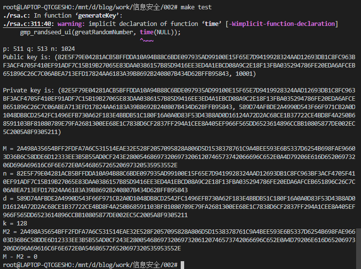

# RSA 算法报告

- 米家龙
- 18342075
- 数据科学与计算机学院

## 目录

- [RSA 算法报告](#rsa-算法报告)
  - [目录](#目录)
  - [原理描述](#原理描述)
  - [数据结构设计](#数据结构设计)
  - [密钥生成](#密钥生成)
  - [解编码](#解编码)
  - [加密](#加密)
  - [解密](#解密)
  - [C 语言代码](#c-语言代码)
  - [编译运行结果](#编译运行结果)

## 原理描述

主要原理：**欧拉定理**

> 对于互素的 a 和 m ，有 $a^{\varphi(m)} \equiv 1 \ ({\rm mod} \ m)$

对于

- 满足$N = pq$的两个不同的素数 p 和 q
- 满足 $0<n<N$ 的整数 n, k 是正整数，有 $n^{k \varphi(N) + 1} \equiv n \ ({\rm mod} \ N)$

由于 $ed \equiv 1 \ ({\rm mod} \ \varphi(N))$，即 $ed = k \varphi(N) + 1$，所以 $n^{ed} = n^{k \varphi(N) + 1} \equiv n \ ({\rm mod} \ N)$

而对于现在存在 $c = n^{e} \ {\rm mod} \  N, \quad n' = c^{d} \ {\rm mod} \ N$

应用模算数运算规则得到 $n' = c^{d} \ {\rm mod} \ N = (n^{e})^{d} \ {\rm mod} \ N = n \ {\rm mod} \ N$ ，即 $n' \equiv n \ {\rm mod} \ N$

## 数据结构设计

> 本次使用了 gmp 库作为大数运算的依据

具体的变量和函数声明如下：

```cpp
#include <stdio.h>
#include <gmp.h>
#include <string.h>
#include <stdlib.h>

mpz_t p, q;                        // 两个素数
mpz_t n;                           // n = p * q
mpz_t phiN;                        // phi(n) = (p - 1) * (q - 1)
mpz_t e;                           // 公钥为 (n, e)
mpz_t d;                           // e 的逆元，需要满足 ed mod phi(n) = 1
                                   // 用于表示私钥 (n, d)
gmp_randstate_t greatRandomNumber; // 随机生成的大数

mpz_t M, C; // M 是明文，C 是加密结果
mpz_t M2;   // 用于解密后的明文储存

char *Message;        // 明文字符串
char *Message2;       // 解密后的明文字符串
char *PS;             // 伪随机生成字符串
char *EM;             // 填充后的明文
char *cryptedText;    // 加密后的字符串
int mLen = 0;         // 明文长度
unsigned long long k; // 长度限制，n 的字节数
FILE *originFile;     // 原始数据
FILE *encryptedFile;  // 加密后的数据
FILE *decryptedFile;  // 解密后的数据
FILE *publicKeyFile;  // 公钥文件
FILE *privateKeyFile; // 私钥文件

/**
 * 生成 p, q, n, phi(n), e 等参数
 * 通过循环进行生成合适的密钥
 * @param bit int 要求的 k 的位数
*/
void generateKey(int bit);

/**
 * 清除所有大数
*/
void clearAll();

/**
 * 生成 PS 字符串
*/
void getPS(int mLen);

/**
 * 得到填充后的明文
*/
void getEM();

/**
 * 将字符串转换为大数
 * @param dst mpz_t 目标大数
 * @param src char* 源字符串
 * @param length int 长度，一般用 k 来作为参数
*/
void OS2IP(mpz_t dst, char src[], unsigned long length);

/**
 * 将大数装换为字符串
 * @param src mpz_t 源大数
 * @param dst char* 目标字符串
 * @param length int 长度，一般用 k 来作为参数
*/
void I2OSP(char dst[], mpz_t src, unsigned long length);

/**
 * 解密函数
*/
void decode();

/**
 * 加密函数
*/
void encode();

/**
 * 由于一开始 k 不确定
 * 因此需要 malloc 函数进行字符串的空间申请
*/
void initString();

/**
 * 加密过程
 * @param publicKeyFilePath char* 公钥文件路径
 * @param privateKeyFilePath char* 私钥文件路径
 * @param originFilePath char* 原始文本路径
 * @param encryptedFilePath char* 加密后的文本路径
*/
void encryption(char publicKeyFilePath[], char privateKeyFilePath[],
                char originFilePath[], char encryptedFilePath[]);

/**
 * 解密过程
 * @param privateKeyFilePath char* 私钥文件路径
 * @param encryptedFilePath char* 加密后的文本路径
 * @param decryptedFilePath char* 解密后的文本路径
*/
void decryption(char privateKeyFilePath[], char encryptedFilePath[],
                char decryptedFilePath[]);
```

## 密钥生成

- 选择两个不同的大素数 p 和 q ，计算 $n = pq$
- 得到 $\varphi(n) = \varphi(pq) = \varphi(p)\varphi(q) = (p - 1) \ (q - 1)$
- 选择一个整数 e ，满足 $1 < e < \varphi(N)$ 并且 ${\rm gcd}(e, \varphi(n)) = 1$
- 找到一个足够大的正整数 d ，满足 $ed \equiv 1 \ ({rm mod} \ \varphi(n))$ ，可以通过拓展欧几里得算法得到
- 得到公钥 (n, e) 和私钥 (n, d)

具体源代码如下：

```cpp
/**
 * 生成 p, q, n, phi(n), e 等参数
 * 通过循环进行生成合适的密钥
 * @param bit int 要求的 k 的位数
*/
void generateKey(int bit);

void generateKey(int bit)
{
  while (1)
  {
    // 随机生成大数
    gmp_randinit_default(greatRandomNumber);
    gmp_randseed_ui(greatRandomNumber, time(NULL));

    // 初始化 p, q
    mpz_init(p);
    mpz_init(q);

    // 随机生成两个大数
    // mpz_urandomb(p, greatRandomNumber, (bit + 1) / 2);
    // mpz_urandomb(q, greatRandomNumber, (bit - 1) / 2);

    mpz_urandomb(p, greatRandomNumber, bit / 2 - 1);
    mpz_urandomb(q, greatRandomNumber, bit / 2 + 1);

    // 素数生成
    mpz_nextprime(p, p);
    mpz_nextprime(q, q);

    // 得到 n
    mpz_init(n);
    mpz_mul(n, p, q);

    if (mpz_sizeinbase(n, 2) == bit) // 用于判断是否生成合适的位数
    {
      break;
    }
  }

  // 计算 phi(n)
  mpz_init(phiN);
  mpz_sub_ui(p, p, 1);
  mpz_sub_ui(q, q, 1);
  mpz_mul(phiN, p, q);

  gmp_printf("p: %d q: %d n: %d\n", mpz_sizeinbase(p, 2), mpz_sizeinbase(q, 2), mpz_sizeinbase(n, 2));

  // 公钥
  // e 通常取 3, 17, 65537
  mpz_init_set_ui(e, 65537);
  gmp_printf("Public key is: (%ZX, %ZX)\n\n", n, e);

  // 私钥
  mpz_init(d);
  mpz_invert(d, e, phiN); // 求逆元
  gmp_printf("Private key is: (%ZX, %ZX)\n\n", n, d);

  initString();
}
```

## 解编码

> 根据公私钥中的 n ，获得 n 的字节数 k

- 构建 PS ，长度为 k - mLen - 3，其中每个字节都是值都是 1 ~ 255 的随机数
- 构建 EM = 0x00 || 0x02 || PS || 0x00 || message

具体源代码如下：

```cpp
void getPS(int mLen)
{
  PS = (char *)malloc(k - mLen - 2);
  PS[k - mLen - 3] = 0;

  for (int i = 0; i < k - mLen - 3; i++)
  {
    PS[i] = rand() % 255 + 1;
  }
}

void getEM()
{
  // 各个部分的长度
  int p1 = 1, p2 = 1, p3 = k - mLen - 3, p4 = 1, p5 = mLen;

  // part 1
  EM[0] = 0;

  // part 2
  EM[1] = 2;

  // part 3
  for (int i = 0; i < p3; i++)
  {
    EM[i + p1 + p2] = PS[i];
  }

  // part 4
  EM[p1 + p2 + p3] = 0;

  // part 5
  for (int i = 0; i < p5; i++)
  {
    EM[p1 + p2 + p3 + p4 + i] = Message[i];
  }

  EM[k] = 0;
}
```

## 加密

> 使用公钥 (n, e)

- 填充
  - 得到公钥中 n 的字节数 k
  - 要求明文 message 字节数 $mLen < k - 11$
  - 根据解编码的规则，获得 EM
- OS2IP：
  - 对于长度为 k 的 EM 存在如下格式$X_{0} \ X_{1}  \ \cdots \  X_{k - 1}$
  - 得到明文大数 $M = X_{0}*256^{k - 1} + X_{1}*256^{k - 2} + X_{2}*256^{k - 3} + \ \cdots \ + X_{k - 2}*256 + X_{k - 1}$
- 加密：
  - $C = M^{e} \ {\bf mod} \ n$
- I2OSP：
  - 根据编码过程和加密后的大数 $C = X_{0}*256^{k - 1} + X_{1}*256^{k - 2} + X_{2}*256^{k - 3} + \ \cdots \ + X_{k - 2}*256 + X_{k - 1}$
  - 逆向得到长度为 k 的 cryptedText $X_{0} \ X_{1} \ \cdots \ X_{k - 1}$
  - 输出密文 cryptedText

具体代码如下：

```cpp
void encode()
{
  getPS(mLen);
  getEM();
  OS2IP(M, EM, k);
  mpz_powm(C, M, e, n);
  I2OSP(cryptedText, C, k);
}
```

其中 `OS2IP` 和 `I2OSP` 的具体实现如下：

```cpp
/**
 * 将字符串转换为大数
 * @param dst mpz_t 目标大数
 * @param src char* 源字符串
 * @param length int 长度，一般用 k 来作为参数
*/
void OS2IP(mpz_t dst, char src[], unsigned long length);

/**
 * 将大数装换为字符串
 * @param src mpz_t 源大数
 * @param dst char* 目标字符串
 * @param length int 长度，一般用 k 来作为参数
*/
void I2OSP(char dst[], mpz_t src, unsigned long length);

void OS2IP(mpz_t dst, char src[], unsigned long length)
{
  mpz_init(dst);
  for (int i = 0; i < length; i++)
  {
    mpz_mul_ui(dst, dst, 256);
    mpz_add_ui(dst, dst, src[i] & 0x0000ff);
  }
}

void I2OSP(char dst[], mpz_t src, unsigned long length)
{
  free(dst);
  dst = (char *)malloc(length + 1);
  mpz_t tmp, copy;
  mpz_init_set(copy, src);

  // 循环生成字符串
  for (int i = length - 1; i >= 0; i--)
  {
    mpz_init(tmp);
    mpz_mod_ui(tmp, copy, 256);
    dst[i] = mpz_get_ui(tmp) & 0x0000ff;
    mpz_div_ui(copy, copy, 256);
  }
}
```

## 解密

> 使用私钥 (n, d)

- 得到公钥中 n 的字节数 k
- 要求密文的字节数需要为 k
- 编码（OS2IP）：同上
- 解密：
  - $M = C^{d} \ {\rm mod} \ n$
- 解码（I2OSP）：同上
- 得到的 EM = 0x00 || 0x22 || PS || 0x00 || message
- 输出解密结果 message

具体实现代码如下：

```cpp
void decode()
{
  OS2IP(C, cryptedText, k);
  mpz_init(M2);
  mpz_powm(M2, C, d, n);
  unsigned long long size = mpz_sizeinbase(n, 2);
  k = size / 8 + (size % 8 ? 1 : 0);
  I2OSP(Message2, M2, k);
}
```

## C 语言代码

完整代码如下，也可查看同文件下的 rsa.c 代码文件：

```cpp
#include <stdio.h>
#include <gmp.h>
#include <string.h>
#include <stdlib.h>

mpz_t p, q;                        // 两个素数
mpz_t n;                           // n = p * q
mpz_t phiN;                        // phi(n) = (p - 1) * (q - 1)
mpz_t e;                           // 公钥为 (n, e)
mpz_t d;                           // e 的逆元，需要满足 ed mod phi(n) = 1
                                   // 用于表示私钥 (n, d)
gmp_randstate_t greatRandomNumber; // 随机生成的大数

mpz_t M, C; // M 是明文，C 是加密结果
mpz_t M2;   // 用于解密后的明文储存

char *Message;        // 明文字符串
char *Message2;       // 解密后的明文字符串
char *PS;             // 伪随机生成字符串
char *EM;             // 填充后的明文
char *cryptedText;    // 加密后的字符串
int mLen = 0;         // 明文长度
unsigned long long k; // 长度限制，n 的字节数
FILE *originFile;     // 原始数据
FILE *encryptedFile;  // 加密后的数据
FILE *decryptedFile;  // 解密后的数据
FILE *publicKeyFile;  // 公钥文件
FILE *privateKeyFile; // 私钥文件

/**
 * 生成 p, q, n, phi(n), e 等参数
 * 通过循环进行生成合适的密钥
 * @param bit int 要求的 k 的位数
*/
void generateKey(int bit);

/**
 * 清除所有大数
*/
void clearAll();

/**
 * 生成 PS 字符串
*/
void getPS(int mLen);

/**
 * 得到填充后的明文
*/
void getEM();

/**
 * 将字符串转换为大数
 * @param dst mpz_t 目标大数
 * @param src char* 源字符串
 * @param length int 长度，一般用 k 来作为参数
*/
void OS2IP(mpz_t dst, char src[], unsigned long length);

/**
 * 将大数装换为字符串
 * @param src mpz_t 源大数
 * @param dst char* 目标字符串
 * @param length int 长度，一般用 k 来作为参数
*/
void I2OSP(char dst[], mpz_t src, unsigned long length);

/**
 * 解密函数
*/
void decode();

/**
 * 加密函数
*/
void encode();

/**
 * 由于一开始 k 不确定
 * 因此需要 malloc 函数进行字符串的空间申请
*/
void initString();

/**
 * 加密过程
 * @param publicKeyFilePath char* 公钥文件路径
 * @param privateKeyFilePath char* 私钥文件路径
 * @param originFilePath char* 原始文本路径
 * @param encryptedFilePath char* 加密后的文本路径
*/
void encryption(char publicKeyFilePath[], char privateKeyFilePath[],
                char originFilePath[], char encryptedFilePath[]);

/**
 * 解密过程
 * @param privateKeyFilePath char* 私钥文件路径
 * @param encryptedFilePath char* 加密后的文本路径
 * @param decryptedFilePath char* 解密后的文本路径
*/
void decryption(char privateKeyFilePath[], char encryptedFilePath[],
                char decryptedFilePath[]);

int main(int argc, char *argv[])
{
  // 如果是加密
  if (strcmp(argv[1], "enc") == 0 && argc == 6)
  {
    encryption(argv[2], argv[3], argv[4], argv[5]);
  }
  // 如果是解密
  else if (strcmp(argv[1], "dec") == 0 && argc == 5)
  {
    decryption(argv[2], argv[3], argv[4]);
  }
  else if (argc == 7 && strcmp(argv[1], "test") == 0) // 两个都进行
  {
    encryption(argv[2], argv[3], argv[4], argv[5]);
    decryption(argv[3], argv[5], argv[6]);
    mpz_t eq;
    mpz_init(eq);
    mpz_sub(eq, M, M2);
    gmp_printf("M - M2 = %ZX\n", eq);
  }
  else
  {
    printf("usage: \n\t./a.out [enc publicKeyFile privateKeyFile | dec privateKeyFile] inputFile outFile\n");
    printf("OR\n");
    printf("\t./a.out test publicKeyFile privateKeyFile inputFile cryptedFile decryptedFile\n");
    return 0;
  }

  clearAll();

  return 0;
}

void decryption(char privateKeyFilePath[], char encryptedFilePath[],
                char decryptedFilePath[])
{
  privateKeyFile = fopen(privateKeyFilePath, "r");
  encryptedFile = fopen(encryptedFilePath, "r");
  decryptedFile = fopen(decryptedFilePath, "w");
  gmp_fscanf(privateKeyFile, "%ZX\n%ZX", n, d);

  unsigned long long size = mpz_sizeinbase(n, 2);
  k = size / 8 + (size % 8 ? 1 : 0);
  initString();
  fread(cryptedText, 1, k, encryptedFile);
  decode();
  gmp_printf("n = %ZX\nd = %ZX\nk = %llu\nM2 = %ZX\n", n, d, k, M2);
  int startAt; // 用于判断 M 的位置
  for (startAt = 1; startAt < k; startAt++)
  {
    if (Message2[startAt] == 0)
    {
      break;
    }
  }

  for (startAt = startAt + 1; startAt < k; startAt++)
  {
    fputc(Message2[startAt], decryptedFile);
  }

  fclose(privateKeyFile);
  fclose(encryptedFile);
  fclose(decryptedFile);
}

void encryption(char publicKeyFilePath[], char privateKeyFilePath[],
                char originFilePath[], char encryptedFilePath[])
{
  publicKeyFile = fopen(publicKeyFilePath, "w");
  privateKeyFile = fopen(privateKeyFilePath, "w");
  originFile = fopen(originFilePath, "r");
  encryptedFile = fopen(encryptedFilePath, "w");

  generateKey(1024);

  gmp_fprintf(publicKeyFile, "%ZX\n%ZX", n, e);  // 输出公钥
  gmp_fprintf(privateKeyFile, "%ZX\n%ZX", n, d); // 输出私钥

  mLen = fread(Message, 1, k, originFile); // 读取文本
  if (mLen > (k - 11))                     // 明文太长
  {
    printf("明文太长\n");
    exit(1);
  }
  encode(); // 进行加密

  for (int i = 0; i < k; i++)
  {
    fputc(cryptedText[i], encryptedFile);
  }

  gmp_printf("M = %ZX\n", M);

  fclose(originFile);
  fclose(privateKeyFile);
  fclose(publicKeyFile);
  fclose(encryptedFile);
}

void decode()
{
  OS2IP(C, cryptedText, k);
  mpz_init(M2);
  mpz_powm(M2, C, d, n);
  unsigned long long size = mpz_sizeinbase(n, 2);
  k = size / 8 + (size % 8 ? 1 : 0);
  I2OSP(Message2, M2, k);
}

void encode()
{
  getPS(mLen);
  getEM();
  OS2IP(M, EM, k);
  mpz_powm(C, M, e, n);
  I2OSP(cryptedText, C, k);
}

void initString()
{
  unsigned long long size = mpz_sizeinbase(n, 2);
  k = size / 8 + (size % 8 ? 1 : 0);
  Message = (char *)malloc(k - 10);
  cryptedText = (char *)malloc(k + 1);
  EM = (char *)malloc(k + 1);
  Message2 = (char *)malloc(k + 1);

  for (int i = 0; i < k; i++)
  {
    cryptedText[i] = Message2[i] = EM[i] = 0;
  }
}

void OS2IP(mpz_t dst, char src[], unsigned long length)
{
  mpz_init(dst);
  for (int i = 0; i < length; i++)
  {
    mpz_mul_ui(dst, dst, 256);
    mpz_add_ui(dst, dst, src[i] & 0x0000ff);
  }
}

void I2OSP(char dst[], mpz_t src, unsigned long length)
{
  free(dst);
  dst = (char *)malloc(length + 1);
  mpz_t tmp, copy;
  mpz_init_set(copy, src);

  // 循环生成字符串
  for (int i = length - 1; i >= 0; i--)
  {
    mpz_init(tmp);
    mpz_mod_ui(tmp, copy, 256);
    dst[i] = mpz_get_ui(tmp) & 0x0000ff;
    mpz_div_ui(copy, copy, 256);
  }
}

void getPS(int mLen)
{
  PS = (char *)malloc(k - mLen - 2);
  PS[k - mLen - 3] = 0;

  for (int i = 0; i < k - mLen - 3; i++)
  {
    PS[i] = rand() % 255 + 1;
  }
}

void getEM()
{
  // 各个部分的长度
  int p1 = 1, p2 = 1, p3 = k - mLen - 3, p4 = 1, p5 = mLen;

  // part 1
  EM[0] = 0;

  // part 2
  EM[1] = 2;

  // part 3
  for (int i = 0; i < p3; i++)
  {
    EM[i + p1 + p2] = PS[i];
  }

  // part 4
  EM[p1 + p2 + p3] = 0;

  // part 5
  for (int i = 0; i < p5; i++)
  {
    EM[p1 + p2 + p3 + p4 + i] = Message[i];
  }

  EM[k] = 0;
}

void generateKey(int bit)
{
  while (1)
  {
    // 随机生成大数
    gmp_randinit_default(greatRandomNumber);
    gmp_randseed_ui(greatRandomNumber, time(NULL));

    // 初始化 p, q
    mpz_init(p);
    mpz_init(q);

    // 随机生成两个大数
    // mpz_urandomb(p, greatRandomNumber, (bit + 1) / 2);
    // mpz_urandomb(q, greatRandomNumber, (bit - 1) / 2);

    mpz_urandomb(p, greatRandomNumber, bit / 2 - 1);
    mpz_urandomb(q, greatRandomNumber, bit / 2 + 1);

    // 素数生成
    mpz_nextprime(p, p);
    mpz_nextprime(q, q);

    // 得到 n
    mpz_init(n);
    mpz_mul(n, p, q);

    if (mpz_sizeinbase(n, 2) == bit) // 用于判断是否生成合适的位数
    {
      break;
    }
  }

  // 计算 phi(n)
  mpz_init(phiN);
  mpz_sub_ui(p, p, 1);
  mpz_sub_ui(q, q, 1);
  mpz_mul(phiN, p, q);

  gmp_printf("p: %d q: %d n: %d\n", mpz_sizeinbase(p, 2), mpz_sizeinbase(q, 2), mpz_sizeinbase(n, 2));

  // 公钥
  // e 通常取 3, 17, 65537
  mpz_init_set_ui(e, 65537);
  gmp_printf("Public key is: (%ZX, %ZX)\n\n", n, e);

  // 私钥
  mpz_init(d);
  mpz_invert(d, e, phiN); // 求逆元
  gmp_printf("Private key is: (%ZX, %ZX)\n\n", n, d);

  initString();
}

void clearAll()
{
  mpz_clear(d);
  mpz_clear(e);
  mpz_clear(n);
  mpz_clear(p);
  mpz_clear(q);
  mpz_clear(phiN);
  mpz_clear(C);
  mpz_clear(M);
  mpz_clear(M2);
}
```

## 编译运行结果

编译运行平台如下：

```bash
root@LAPTOP-QTCGESHO:/mnt/d/blog/work/信息安全/002# uname -a
Linux LAPTOP-QTCGESHO 4.4.0-19041-Microsoft #488-Microsoft Mon Sep 01 13:43:00 PST 2020 x86_64 x86_64 x86_64 GNU/Linux
```

使用 Makefile 进行相关命令的操作，具体代码如下，也可直接查看该文件夹下面的 Makefile 文件：

```makefile
GCC := gcc # 编译器
GMP := gmp # 连接库
SOURCE := ./rsa.c # C语言源代码

ORIGINFILE := ./in.txt # 原始文本文件
ENCRYPTEDFILE := ./encrypted.txt # 加密后的文件
DECRYPTEDFILE := ./decrypted.txt # 解密后的文件
PUBLICKEYFILE := ./publicKey.txt # 公钥储存文件
PRIVATEKEYFILE := ./privateKey.txt # 私钥储存文件

ENC := enc # 加密
DEC := dec # 解密
TEST := test # 测试

# 执行文件
a.out: ${SOURCE}
	@${GCC} ${SOURCE} -o $@ -l${GMP}

# 加密
enc: a.out
	@./a.out ${ENC} ${PUBLICKEYFILE} ${PRIVATEKEYFILE} ${ORIGINFILE} ${ENCRYPTEDFILE}

# 解密
dec: a.out
	@./a.out ${DEC} ${PRIVATEKEYFILE} ${ENCRYPTEDFILE} ${DECRYPTEDFILE}

# 一个完整的流程
test: a.out
	@./a.out ${TEST} ${PUBLICKEYFILE} ${PRIVATEKEYFILE} ${ORIGINFILE} ${ENCRYPTEDFILE} ${DECRYPTEDFILE}
```

设置 in.txt 文件中的明文如下

```txt
This is a test file.
My name is mijialong.
There is SYSU.
```

执行 `make enc` ，输出如下：


执行 `make dec` ，输出如下：


查看 encrypted.txt 和 decrypted.txt ，具体如下图：


直接执行 `make test` ，具体结果如下：



通过对比两次加密解密得到的 M 和 M2 ，可以初步判断代码符合需求
