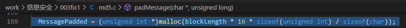
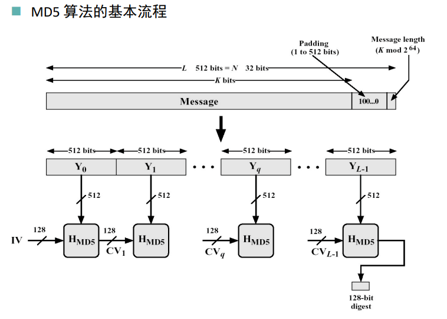
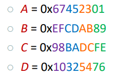
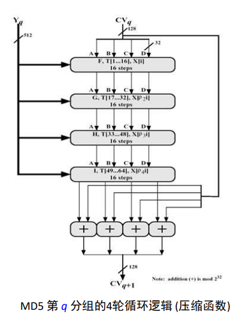
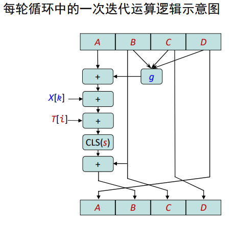
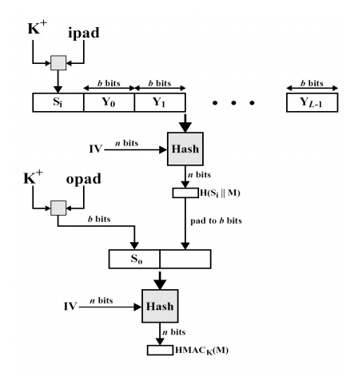
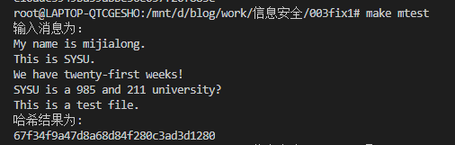
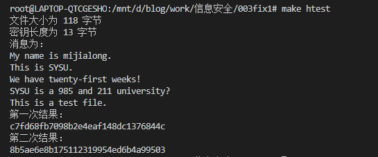

# RSA 算法报告

- 米家龙
- 18342075
- 数据科学与计算机学院

- [RSA 算法报告](#rsa-算法报告)
  - [原理概述](#原理概述)
    - [MD5](#md5)
      - [总控流程](#总控流程)
      - [压缩函数 $H_{MD5}$](#压缩函数-h_md5)
        - [轮函数 $F, G, H, I$](#轮函数-f-g-h-i)
          - [X表](#x表)
          - [T 表](#t-表)
          - [S 表](#s-表)
    - [HMAC 算法](#hmac-算法)
  - [总体结构设计](#总体结构设计)
  - [数据结构设计](#数据结构设计)
    - [MD5](#md5-1)
    - [HMAC](#hmac)
  - [模块分解](#模块分解)
    - [MD5](#md5-2)
    - [HMAC](#hmac-1)
  - [C语言代码](#c语言代码)
    - [md5.c](#md5c)
    - [hmac-md5.c](#hmac-md5c)
    - [md5test.c](#md5testc)
  - [编译运行结果](#编译运行结果)
  - [验证用例](#验证用例)

> 代码和报告更新说明：
> - 对 md5.c 代码169行和报告相关部分相关更新，避免了动态内存越界报错的问题，如下图：
> - 

## 原理概述

### MD5

基本流程如下图：



#### 总控流程

- 以512-bit 消息分组为单位，每一分组 $Y_q (q = 0, 1, …, L-1)$ 经过4个循环的压缩算法，表示为

$$
\begin{aligned}
  & CV_0 = IV \\
  & CV_I = H_{MD5}(CV_{i - 1}, Y_{i - 1}), i = 1, \dots, L
\end{aligned}
$$

其中初始向量 $IV$ 为：



- 最终结果为：$MD = CV_L$

#### 压缩函数 $H_{MD5}$

- $H_{MD5}$ 从 $CV$ 输入128位，从消息分组输入512位，完成4轮循环后，输出128位，作为用于下一轮输入的 $CV$ 值。
- 每轮循环分别固定不同的生成函数 $F, G, H, I$，结合指定的 T 表元素 T[] 和消息分组的不同部分 X[] 做16次迭代运算，生成下一轮循环的输入。
- 4轮循环共有64次迭代运算。

流程如下图：



##### 轮函数 $F, G, H, I$

> 4轮循环中使用的生成函数 g (也称**轮函数**) 是一个32位非线性逻辑函数。同一轮循环的所有迭代使用相同的 g 函数，而各轮循环对应的 g 函数具有不同的定义，具体如下：

| 轮次  |      g       |            $g(b, c, d)$             |
| :---: | :----------: | :---------------------------------: |
|   1   | $F(b, c, d)$ | $(b \land c) \lor (\neg b \land d)$ |
|   2   | $G(b, c, d)$ | $(b \land c) \lor (c \land \neg d)$ |
|   3   | $H(b, c, d)$ |        $b \oplus c \oplus d$        |
|   4   | $I(b, c, d)$ |     $c \oplus (b \lor \neg d)$      |

每轮循环中的一次迭代运算逻辑
1. 对 A 迭代：$a \leftarrow b + ((a + g(b, c, d) + X[k] + T[i]) <<< s)$
2. 对缓冲区：$(B, C, D, A) \leftarrow (A, B, C, D)$

> - $a, b, c, d$：MD 缓冲区 $(A, B, C, D)$ 的各个寄存器的当前值
> - $g$：轮函数 $F, G, H, I$ 中的一个
> - $<<< s$：将32位输入循环左移 (CLS) $s$ 位；$s$ 为规定值
> - $X[k]$：当前处理消息分组 $q$ 的第 k 个 $(k = 0 \dots 15)$ 32位字。如果消息 M 按 32-bit 编址，即为 $M_{q \times 16 + k}$
> - $T[i]$： T 表的第 i 个元素，32位字；T 表总共有64个元素，也称为加法常数
> - $+$： 模 $2^{32}$ 加法

一次迭代流程如图：



###### X表

> 四轮循环，16次迭代，合计64次

在每轮循环第 i 次迭代$(i = 0 \dots 15)$中，$X[k]$ 的选择如下：
- 第1轮迭代：$k = i$
- 第2轮迭代：$k = (1 + 5i) \mod 16$
- 第3轮迭代：$k = (5 + 3i) \mod 16$
- 第4轮迭代：$k = 7j \mod 16$

###### T 表

T 表生成函数：
$$
\begin{aligned}
  & T[i] = \rm{int} (2^{32} \times | \sin(i) |)
\end{aligned}
$$
- $int$ 取整函数
- $\sin$ 正弦函数
- $i$ 弧度

###### S 表

每次迭代$(i = 0 \dots 63)$ 采用的左循环移位的位数 s 值

$$
\begin{aligned}
  S[0 \dots 15] & = \{ 7, 12, 17, 22, 7, 12, 17, 22, 7, 12, 17, 22, 7, 12, 17, 22 \} \\
  S[16 \dots 31] & = \{ 5, 9, 14, 20, 5, 9, 14, 20, 5, 9, 14, 20, 5, 9, 14, 20 \} \\ 
  S[32 \dots 47] & = \{ 4, 11, 16, 23, 4, 11, 16, 23, 4, 11, 16, 23, 4, 11, 16, 23 \} \\ 
  S[48 \dots 63] & = \{ 6, 10, 15, 21, 6, 10, 15, 21, 6, 10, 15, 21, 6, 10, 15, 21 \} \\ 
\end{aligned}
$$

### HMAC 算法

总体流程如图：



> - **M** – message input to HMAC
> - **H** – embedded hash function
> - **b** – length (bits) of input block
> - **k** – secrete key, |k| < b
> - **n** – length of hash code
> - *ipad* – 00110110 (0x36) 重复 b/8 次
> - *opad* – 01011100 (0x5c) 重复 b/8 次

1. 对共享密钥 k 右边进行补0，生成一个**64字节**的数据块 $K^+$
2. $K^+$ 与 $ipad$ 进行异或，生成64字节的 $S_i$
3.  $(S_i \parallel M)$ 进行 hash 压缩 (例如 MD5)，得到 $H(S_i \parallel M)$
4.  $K^+$ 与 $opad$ 进行异或，生成64字节的 $S_o$
5.  对 $S_o \parallel H(S_i \parallel M)$ 进行 hash 压缩 (例如 MD5)，得到 $HMAC_K = H(S_o \parallel H(S_i \parallel M))$

> $\parallel$ 代表字符串拼接

## 总体结构设计

该项目分成三个文件，如下：
- md5.c ：MD5 算法文件
- hamc-md5.c ：HMAC_MD5 算法文件
- md5test.c ：用于测试 MD5 算法的测试文件

## 数据结构设计

### MD5

函数和数据结构设计如下：
```cpp
#define F(b, c, d) ((b & c) | (~b & d))        // 第一轮
#define G(b, c, d) ((b & d) | (c & ~d))        // 第二轮
#define H(b, c, d) (b ^ c ^ d)                 // 第三轮
#define I(b, c, d) (c ^ (b | ~d))              // 第四轮
#define CLS(x, s) ((x << s) | (x >> (32 - s))) // 循环左移

typedef struct
{
  unsigned int content[4];
} MD5_CTX;

// 初始向量，小端
const unsigned int IV[4] = {
    0x67452301,
    0xEFCDAB89,
    0x98BADCFE,
    0x10325476};

unsigned int CV[4] = {
    0x67452301,
    0xEFCDAB89,
    0x98BADCFE,
    0x10325476};

// 各轮各次迭代运算采用的 T 值
const int T_TABLE[] = {
    0xd76aa478, 0xe8c7b756, 0x242070db, 0xc1bdceee,
    0xf57c0faf, 0x4787c62a, 0xa8304613, 0xfd469501,
    0x698098d8, 0x8b44f7af, 0xffff5bb1, 0x895cd7be,
    0x6b901122, 0xfd987193, 0xa679438e, 0x49b40821,
    0xf61e2562, 0xc040b340, 0x265e5a51, 0xe9b6c7aa,
    0xd62f105d, 0x02441453, 0xd8a1e681, 0xe7d3fbc8,
    0x21e1cde6, 0xc33707d6, 0xf4d50d87, 0x455a14ed,
    0xa9e3e905, 0xfcefa3f8, 0x676f02d9, 0x8d2a4c8a,
    0xfffa3942, 0x8771f681, 0x6d9d6122, 0xfde5380c,
    0xa4beea44, 0x4bdecfa9, 0xf6bb4b60, 0xbebfbc70,
    0x289b7ec6, 0xeaa127fa, 0xd4ef3085, 0x04881d05,
    0xd9d4d039, 0xe6db99e5, 0x1fa27cf8, 0xc4ac5665,
    0xf4292244, 0x432aff97, 0xab9423a7, 0xfc93a039,
    0x655b59c3, 0x8f0ccc92, 0xffeff47d, 0x85845dd1,
    0x6fa87e4f, 0xfe2ce6e0, 0xa3014314, 0x4e0811a1,
    0xf7537e82, 0xbd3af235, 0x2ad7d2bb, 0xeb86d391};

// 各轮各次迭代运算 (1 .. 64) 采用的左循环移位的位数 s 值
const int S_TABLE[] = {
    7, 12, 17, 22, 7, 12, 17, 22, 7, 12, 17, 22, 7, 12, 17, 22,
    5, 9, 14, 20, 5, 9, 14, 20, 5, 9, 14, 20, 5, 9, 14, 20,
    4, 11, 16, 23, 4, 11, 16, 23, 4, 11, 16, 23, 4, 11, 16, 23,
    6, 10, 15, 21, 6, 10, 15, 21, 6, 10, 15, 21, 6, 10, 15, 21};

// 暂时没用上
const int X_TABLE[4][16] = {
    {0, 1, 2, 3, 4, 5, 6, 7, 8, 9, 10, 11, 12, 13, 14, 15},  // k = j
    {1, 6, 11, 0, 5, 10, 15, 4, 9, 14, 3, 8, 13, 2, 7, 12},  // k = (1 + 5 * j) % 16
    {5, 8, 11, 14, 1, 4, 7, 10, 13, 0, 3, 6, 9, 12, 15, 2},  // k = (5 + 3 * j) % 16
    {0, 7, 14, 5, 12, 3, 10, 1, 8, 15, 6, 13, 4, 11, 2, 9}}; // k = (7 * j) % 16

unsigned int *MessagePadded; // 由字符串转化而成的32位块
unsigned long blockLength;   // 512位块的长度
unsigned char *messagePaddingTmp;
```

### HMAC

相关声明如下：
```cpp
#define BLOCKSIZE 64

unsigned long b = 0;       // length (bits) of input block
unsigned long kLength = 0; // length (bits) of input key
char *M;                   // Message
char *k;                   // 密钥
char *KPlus;               // 根据输入内容和密钥生成的数据块
char *Si;                  // K+ ^ ipad
char *So;                  // K+ ^ opad

#define ipad 0x36 // 00110110
#define opad 0x5c // 01011100
```

## 模块分解

### MD5

具体函数声明如下：
```cpp
/**
 * 初始化向量
*/
void CVInit(unsigned int CV[4]);

/**
 * 填充步骤
 * @param originMessage char* 原始消息
 * @param messageLength unsigned long long 为了避免特殊情况，将明文长度（字节数）作为输入
*/
void padMessage(char *originMessage, unsigned long messageLength);

/**
 * 主要函数
 * @param originMessage char* 原始消息
 * @param messageLength unsigned long long 为了避免特殊情况，将明文长度（字节数）作为输入
*/
MD5_CTX MD5(char *originMessage, unsigned long messageLength);

/**
 * 将字符串转换为数字
 * @param src unsigned char* 源字符串
 * @param charLength unsigned long 字符串长度
 * @return 一个 unsigned int 数组指针
*/
unsigned int *MD5_Decode(unsigned char *src, unsigned int *dst, unsigned long charLength);

/**
 * 将数字转换为字符串
 * @param src unsigned int* 源数组
 * @param intLength unsigned long 数组长度
*/
unsigned char *MD5_Encode(unsigned int *src, unsigned char *dst, unsigned long intLength);

/**
 * MD5 压缩函数
 * @paramthisCV char* 输入向量，128位
 * @param Y int* 分组，每个分组为一个块，512位
 * @param res int* 返回结果
*/
void H_MD5(int *Y, unsigned int *res);

/**
 * 释放内存
*/
void clear();
```

其中主要函数 `MD5()` 具体代码如下：
```cpp
MD5_CTX MD5(char *originMessage, unsigned long messageLength)
{
  MD5_CTX res;
  padMessage(originMessage, messageLength); // 消息填充
  CVInit(CV);                               // 初始化 CV

  for (int i = 0; i < blockLength; i++)
  {
    unsigned int tmp[4] = {0, 0, 0, 0};
    H_MD5(MessagePadded + i * 16, tmp);
    for (int j = 0; j < 4; j++)
    {
      CV[j] += tmp[j];
    }
  }

  clear();
  return res;
}
```

### HMAC

相关函数声明如下：
```cpp
/**
 * 获取文件的大小，并设置初始的相关值
 * @param inputFilename char* 输入文件名
 * @param keyFilename char* 密钥文件名
 * @return 1 | 0 ，其中0代表密钥不符合要求
*/
int getFileSize(char *inputFilename, char *keyFilename);

/**
 * 生成 K+ ，顺带生成 Si 和 So
*/
void generateKPlus();

/**
 * 哈希函数
 * @param S unsigned char* 第一个字符串
 * @param SLength unsigned long 第一个字符串的长度
 * @param M unsigned char* 第二个字符串
 * @param MLength unsigned long 第二个字符串的长度
 * @return MD5_CTX 结构体
*/
MD5_CTX Hash(unsigned char *S, unsigned long SLength, unsigned char *M, unsigned long MLength);

/**
 * 释放内存
*/
void freeAll();
```

## C语言代码

### md5.c

```cpp
#include <stdio.h>
#include <stdlib.h>

#define F(b, c, d) ((b & c) | (~b & d))        // 第一轮
#define G(b, c, d) ((b & d) | (c & ~d))        // 第二轮
#define H(b, c, d) (b ^ c ^ d)                 // 第三轮
#define I(b, c, d) (c ^ (b | ~d))              // 第四轮
#define CLS(x, s) ((x << s) | (x >> (32 - s))) // 循环左移

typedef struct
{
  unsigned int content[4];
} MD5_CTX;

// 初始向量，小端
const unsigned int IV[4] = {
    0x67452301,
    0xEFCDAB89,
    0x98BADCFE,
    0x10325476};

unsigned int CV[4] = {
    0x67452301,
    0xEFCDAB89,
    0x98BADCFE,
    0x10325476};

// 各轮各次迭代运算采用的 T 值
const int T_TABLE[] = {
    0xd76aa478, 0xe8c7b756, 0x242070db, 0xc1bdceee,
    0xf57c0faf, 0x4787c62a, 0xa8304613, 0xfd469501,
    0x698098d8, 0x8b44f7af, 0xffff5bb1, 0x895cd7be,
    0x6b901122, 0xfd987193, 0xa679438e, 0x49b40821,
    0xf61e2562, 0xc040b340, 0x265e5a51, 0xe9b6c7aa,
    0xd62f105d, 0x02441453, 0xd8a1e681, 0xe7d3fbc8,
    0x21e1cde6, 0xc33707d6, 0xf4d50d87, 0x455a14ed,
    0xa9e3e905, 0xfcefa3f8, 0x676f02d9, 0x8d2a4c8a,
    0xfffa3942, 0x8771f681, 0x6d9d6122, 0xfde5380c,
    0xa4beea44, 0x4bdecfa9, 0xf6bb4b60, 0xbebfbc70,
    0x289b7ec6, 0xeaa127fa, 0xd4ef3085, 0x04881d05,
    0xd9d4d039, 0xe6db99e5, 0x1fa27cf8, 0xc4ac5665,
    0xf4292244, 0x432aff97, 0xab9423a7, 0xfc93a039,
    0x655b59c3, 0x8f0ccc92, 0xffeff47d, 0x85845dd1,
    0x6fa87e4f, 0xfe2ce6e0, 0xa3014314, 0x4e0811a1,
    0xf7537e82, 0xbd3af235, 0x2ad7d2bb, 0xeb86d391};

// 各轮各次迭代运算 (1 .. 64) 采用的左循环移位的位数 s 值
const int S_TABLE[] = {
    7, 12, 17, 22, 7, 12, 17, 22, 7, 12, 17, 22, 7, 12, 17, 22,
    5, 9, 14, 20, 5, 9, 14, 20, 5, 9, 14, 20, 5, 9, 14, 20,
    4, 11, 16, 23, 4, 11, 16, 23, 4, 11, 16, 23, 4, 11, 16, 23,
    6, 10, 15, 21, 6, 10, 15, 21, 6, 10, 15, 21, 6, 10, 15, 21};

// 暂时没用上
const int X_TABLE[4][16] = {
    {0, 1, 2, 3, 4, 5, 6, 7, 8, 9, 10, 11, 12, 13, 14, 15},  // k = j
    {1, 6, 11, 0, 5, 10, 15, 4, 9, 14, 3, 8, 13, 2, 7, 12},  // k = (1 + 5 * j) % 16
    {5, 8, 11, 14, 1, 4, 7, 10, 13, 0, 3, 6, 9, 12, 15, 2},  // k = (5 + 3 * j) % 16
    {0, 7, 14, 5, 12, 3, 10, 1, 8, 15, 6, 13, 4, 11, 2, 9}}; // k = (7 * j) % 16

unsigned int *MessagePadded; // 由字符串转化而成的32位块
unsigned long blockLength;   // 512位块的长度
unsigned char *messagePaddingTmp;

/**
 * 初始化向量
*/
void CVInit(unsigned int CV[4]);

/**
 * 填充步骤
 * @param originMessage char* 原始消息
 * @param messageLength unsigned long long 为了避免特殊情况，将明文长度（字节数）作为输入
*/
void padMessage(char *originMessage, unsigned long messageLength);

/**
 * 主要函数
 * @param originMessage char* 原始消息
 * @param messageLength unsigned long long 为了避免特殊情况，将明文长度（字节数）作为输入
*/
MD5_CTX MD5(char *originMessage, unsigned long messageLength);

/**
 * 将字符串转换为数字
 * @param src unsigned char* 源字符串
 * @param charLength unsigned long 字符串长度
 * @return 一个 unsigned int 数组指针
*/
unsigned int *MD5_Decode(unsigned char *src, unsigned int *dst, unsigned long charLength);

/**
 * 将数字转换为字符串
 * @param src unsigned int* 源数组
 * @param intLength unsigned long 数组长度
*/
unsigned char *MD5_Encode(unsigned int *src, unsigned char *dst, unsigned long intLength);

/**
 * MD5 压缩函数
 * @paramthisCV char* 输入向量，128位
 * @param Y int* 分组，每个分组为一个块，512位
 * @param res int* 返回结果
*/
void H_MD5(int *Y, unsigned int *res);

/**
 * 释放内存
*/
void clear();

void clear()
{
  free(MessagePadded);
  free(messagePaddingTmp);
}

MD5_CTX MD5(char *originMessage, unsigned long messageLength)
{
  MD5_CTX res;
  padMessage(originMessage, messageLength); // 消息填充
  CVInit(CV);                               // 初始化 CV

  for (int i = 0; i < blockLength; i++)
  {
    unsigned int tmp[4] = {0, 0, 0, 0};
    H_MD5(MessagePadded + i * 16, tmp);
    for (int j = 0; j < 4; j++)
    {
      CV[j] += tmp[j];
    }
  }

  // 放到结果中
  for (int i = 0; i < 4; i++)
  {
    res.content[i] = CV[i];
  }

  clear();
  return res;
}

void CVInit(unsigned int thisCV[4])
{
  for (int i = 0; i < 4; i++)
  {
    thisCV[i] = IV[i];
  }
}

void padMessage(char *originMessage, unsigned long messageLength)
{
  blockLength = messageLength / 64 + (((messageLength * 8) % 512) >= 448 ? 2 : 1);
  messagePaddingTmp = (unsigned char *)malloc(blockLength * 64);
  for (int i = 0; i < messageLength; i++)
  {
    messagePaddingTmp[i] = originMessage[i];
  }

  // 后续填充为0
  for (int i = messageLength; i < blockLength * 64; i++)
  {
    messagePaddingTmp[i] = 0;
  }

  messagePaddingTmp[messageLength] = 0x80; // 结束的第一位为1

  MessagePadded = (unsigned int *)malloc(blockLength * 16 * sizeof(unsigned int) / sizeof(char));
  MD5_Decode(messagePaddingTmp, MessagePadded, blockLength * 64);
  unsigned int front32 = ((messageLength * 8) >> 32) & 0x00000000ffffffff; // 前32位，但是需要倒序放在最后
  unsigned int behind32 = (messageLength * 8) & 0x00000000ffffffff;        // 后32位，倒序放在最前
  MessagePadded[blockLength * 16 - 2] = behind32;
  MessagePadded[blockLength * 16 - 1] = front32;

  return;
}

unsigned char *MD5_Encode(unsigned int *src, unsigned char *dst, unsigned long intLength)
{
  for (int i = 0; i < intLength; i++)
  {
    dst[i * 4 + 3] = (src[i] >> 24) & 0x000000ff;
    dst[i * 4 + 2] = (src[i] >> 16) & 0x000000ff;
    dst[i * 4 + 1] = (src[i] >> 8) & 0x000000ff;
    dst[i * 4] = src[i] & 0x000000ff;
  }

  return dst;
}

unsigned int *MD5_Decode(unsigned char *src, unsigned int *dst, unsigned long charLength)
{
  for (int i = 0; i < charLength / 4; i++)
  {
    dst[i] = (src[i * 4]) |
             (src[i * 4 + 1] << 8) |
             (src[i * 4 + 2] << 16) |
             (src[i * 4 + 3] << 24);
  }

  return dst;
}

void H_MD5(int *Y, unsigned int res[4])
{
  unsigned int thisCV[4];
  unsigned int nextCV[4];

  for (int i = 0; i < 4; i++)
  {
    thisCV[i] = CV[i];
  }
  // 四轮循环，每轮循环16步
  for (int j = 0; j < 4; j++)
  {
    for (int i = 0; i < 16; i++)
    {
      // 每次迭代的参数都有变化
      switch (j)
      {
      case 0:
        nextCV[1] = thisCV[1] +
                    CLS((thisCV[0] +
                         F(thisCV[1], thisCV[2], thisCV[3]) +
                         Y[i] +
                         T_TABLE[i]),
                        S_TABLE[i]);
        break;
      case 1:
        nextCV[1] = thisCV[1] +
                    CLS((thisCV[0] +
                         G(thisCV[1], thisCV[2], thisCV[3]) +
                         Y[(1 + 5 * i) % 16] +
                         T_TABLE[i + j * 16]),
                        S_TABLE[i + j * 16]);
        break;
      case 2:
        nextCV[1] = thisCV[1] +
                    CLS((thisCV[0] +
                         H(thisCV[1], thisCV[2], thisCV[3]) +
                         Y[(5 + 3 * i) % 16] +
                         T_TABLE[i + j * 16]),
                        S_TABLE[i + j * 16]);
        break;
      case 3:
        nextCV[1] = thisCV[1] +
                    CLS((thisCV[0] +
                         I(thisCV[1], thisCV[2], thisCV[3]) +
                         Y[(7 * i) % 16] +
                         T_TABLE[i + j * 16]),
                        S_TABLE[i + j * 16]);
        break;
      default:
        break;
      }
      nextCV[2] = thisCV[1];
      nextCV[3] = thisCV[2];
      nextCV[0] = thisCV[3];

      // 迭代
      for (int i = 0; i < 4; i++)
      {
        thisCV[i] = nextCV[i];
      }
    }
  }

  for (int i = 0; i < 4; i++)
  {
    res[i] = thisCV[i];
  }
}
```

### hmac-md5.c

```cpp
#include <stdio.h>
#include <sys/stat.h>
#include <stdlib.h>
#include <string.h>
#include "md5.c"

#define BLOCKSIZE 64

unsigned long b = 0;       // length (bits) of input block
unsigned long kLength = 0; // length (bits) of input key
char *M;                   // Message
char *k;                   // 密钥
char *KPlus;               // 根据输入内容和密钥生成的数据块
char *Si;                  // K+ ^ ipad
char *So;                  // K+ ^ opad

#define ipad 0x36 // 00110110
#define opad 0x5c // 01011100

/**
 * 获取文件的大小，并设置初始的相关值
 * @param inputFilename char* 输入文件名
 * @param keyFilename char* 密钥文件名
 * @return 1 | 0 ，其中0代表密钥不符合要求
*/
int getFileSize(char *inputFilename, char *keyFilename);

/**
 * 生成 K+ ，顺带生成 Si 和 So
*/
void generateKPlus();

/**
 * 哈希函数
 * @param S unsigned char* 第一个字符串
 * @param SLength unsigned long 第一个字符串的长度
 * @param M unsigned char* 第二个字符串
 * @param MLength unsigned long 第二个字符串的长度
 * @return MD5_CTX 结构体
*/
MD5_CTX Hash(unsigned char *S, unsigned long SLength, unsigned char *M, unsigned long MLength);

/**
 * 释放内存
*/
void freeAll();

int main(int argc, char *argv[])
{
  if (argc != 3)
  {
    printf("usage: ./a.out inputFile keyFile\n");
    return 0;
  }
  else
  {
    FILE *inputFile, *keyFile;
    if (!getFileSize(argv[1], argv[2]))
    {
      printf("密钥和文本不匹配\n");
      return 0;
    }

    inputFile = fopen(argv[1], "r");
    keyFile = fopen(argv[2], "r");

    fread(M, 1, b, inputFile);
    fread(k, 1, kLength, keyFile);

    generateKPlus();

    printf("消息为：\n%s\n", M);

    // 第一次哈希
    MD5_CTX firstResult = Hash(Si, BLOCKSIZE, M, b); // 第一次结果
    unsigned char firstResultString[16];             // 第一次结果的字符串
    MD5_Encode(firstResult.content, firstResultString, 4);
    printf("第一次结果：\n");
    for (int i = 0; i < 4 * 4; i++)
    {
      printf("%02x", firstResultString[i]);
    }
    putchar('\n');

    //第二次哈希
    MD5_CTX secondResult = Hash(So, BLOCKSIZE, firstResultString, 16); // 第二次结果
    unsigned char secondResultString[16];                              // 第二次结果的字符串
    printf("第二次结果：\n");
    MD5_Encode(secondResult.content, secondResultString, 4);
    for (int i = 0; i < 4 * 4; i++)
    {
      printf("%02x", secondResultString[i]);
    }
    putchar('\n');

    fclose(inputFile);
    fclose(keyFile);
    freeAll();
    return 0;
  }
}

MD5_CTX Hash(unsigned char *S, unsigned long SLength, unsigned char *M, unsigned long MLength)
{
  /**
   * 拼接两个字符串
   * 不敢用 strcat() 怕有 0 的存在
  */
  unsigned char SM[MLength + SLength + 1];
  SM[SLength + MLength] = 0;

  // 第一段
  for (unsigned long i = 0; i < SLength; i++)
  {
    SM[i] = S[i];
  }

  // 第二段
  for (unsigned long i = 0; i < MLength; i++)
  {
    SM[i + SLength] = M[i];
  }

  MD5_CTX res = MD5(SM, SLength + MLength);

  return res;
}

void freeAll()
{
  free(M);
  free(k);
  free(KPlus);
  free(Si);
  free(So);
}

int getFileSize(char *inputFilename, char *keyFilename)
{
  struct stat inputFileBuffer, keyFileBuffer;
  stat(inputFilename, &inputFileBuffer);
  stat(keyFilename, &keyFileBuffer);
  b = inputFileBuffer.st_size;     // 消息大小
  kLength = keyFileBuffer.st_size; // 密钥长度
  printf("文件大小为 %ld 字节\n密钥长度为 %ld 字节\n", b, kLength);

  // 如果密钥不符合要求
  if (BLOCKSIZE < kLength)
  {
    return 0;
  }
  else
  {
    M = (char *)malloc(b);
    k = (char *)malloc(BLOCKSIZE);
    return 1;
  }
}

void generateKPlus()
{
  KPlus = (char *)malloc(BLOCKSIZE);

  // 右边补位0
  for (unsigned long i = 0; i < kLength; i++)
  {
    KPlus[i] = k[i];
  }

  for (unsigned long i = kLength; i < BLOCKSIZE; i++)
  {
    KPlus[i] = 0;
  }

  // 顺带获取 Si 和 So
  Si = (char *)malloc(BLOCKSIZE);
  So = (char *)malloc(BLOCKSIZE);

  for (unsigned long i = 0; i < BLOCKSIZE; i++)
  {
    Si[i] = KPlus[i] ^ ipad;
    So[i] = KPlus[i] ^ opad;
  }
}
```

### md5test.c

```cpp
#include <stdio.h>
#include <stdlib.h>
#include <sys/stat.h>
#include "md5.c"

int main(int argc, char *argv[])
{
  if (argc != 2)
  {
    printf("usage: ./md5 inputFile\n");
    return 0;
  }
  FILE *inputFile;
  struct stat inputFileBuffer;
  stat(argv[1], &inputFileBuffer);
  long inputFileSize = inputFileBuffer.st_size;      // 输入文件的大小
  char *message = (char *)malloc(inputFileSize + 1); // 消息

  // 读取文件
  inputFile = fopen(argv[1], "r");
  inputFileSize = fread(message, 1, inputFileSize, inputFile);

  printf("输入消息为：\n%s\n", message);

  // 获取结果
  MD5_CTX res = MD5(message, inputFileSize);
  unsigned char rres[16];
  MD5_Encode(res.content, rres, 4);

  // 输出结果
  printf("哈希结果为: \n");
  for (int i = 0; i < 16; i++)
  {
    printf("%02x", rres[i]);
  }
  printf("\n");

  return 0;
}
```

## 编译运行结果

运行环境为 win10 环境下的 wsl （ubuntu 18.04）：
```bash
root@LAPTOP-QTCGESHO:/mnt/d/blog/work/信息安全/003fix1# uname -a
Linux LAPTOP-QTCGESHO 4.4.0-19041-Microsoft #488-Microsoft Mon Sep 01 13:43:00 PST 2020 x86_64 x86_64 x86_64 GNU/Linux
```

采用 makefile 进行简化操作，makefile 具体代码如下：
```makefile
GCC := gcc 								# 编译器
HMAC-MD5 := ./hmac-md5.c 	# hmac-md5 语言源代码
MD5 := ./md5.c 						# md5 算法代码
MD5TEST := ./md5test.c 		# md5test 代码

ORIGINFILE := ./input.txt 	# 原始文本文件
KEYFILE := ./key.txt 				# 密钥储存文件
OUTPUTFILE := ./output.txt 	# 私钥储存文件

# hmac-md5 测试
htest: hmac-md5
	@./hmac-md5 ${ORIGINFILE} ${KEYFILE}

# 生成 hmac-md5 可执行文件
hmac-md5: ${HMAC-MD5} ${MD5}
	@${GCC} ${HMAC-MD5} -o $@

# md5 测试
mtest: md5
	@./md5 ${ORIGINFILE}

# 生成 md5test 文件
md5: ${MD5TEST} ${MD5}
	@${GCC} ${MD5TEST} -o $@

# 清空垃圾文件
clean: 
	@rm md5 || exit 0
	@rm hmac-md5  || exit 0
```

测试文件（input.txt）文本为
```txt
My name is mijialong.
This is SYSU.
We have twenty-first weeks!
SYSU is a 985 and 211 university?
This is a test file.
```

MD5 测试运行结果为



密钥文件（key.txt）文本为
```txt
this is a key
```

HMAC-MD5 运行结果为：



## 验证用例

使用[在线加密解密网站](https://tool.oschina.net/encrypt?type=2)进行结果的验证

> 需要注意复制文本时结尾不是以回车符结尾

1. MD5 验证

结果如下图：


2. HMAC-MD5 验证

结果如下图：

