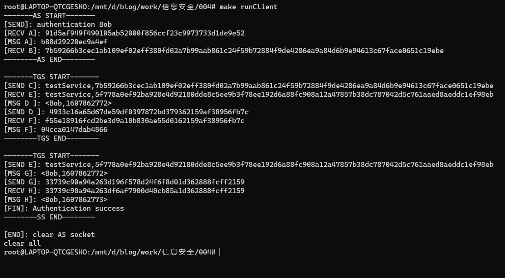
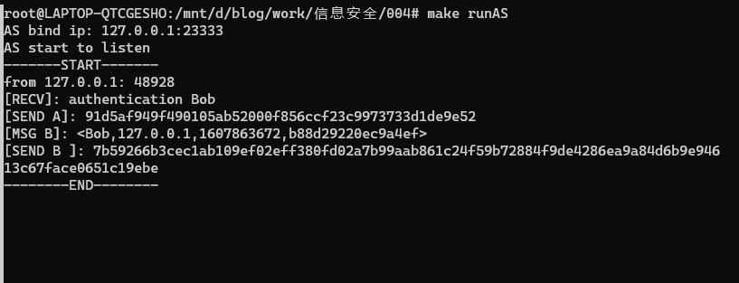
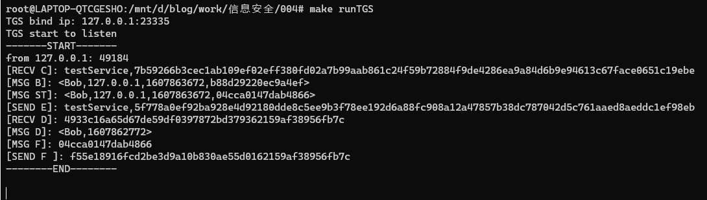
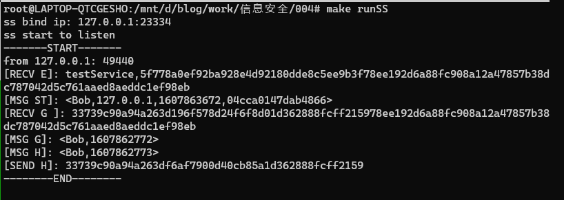
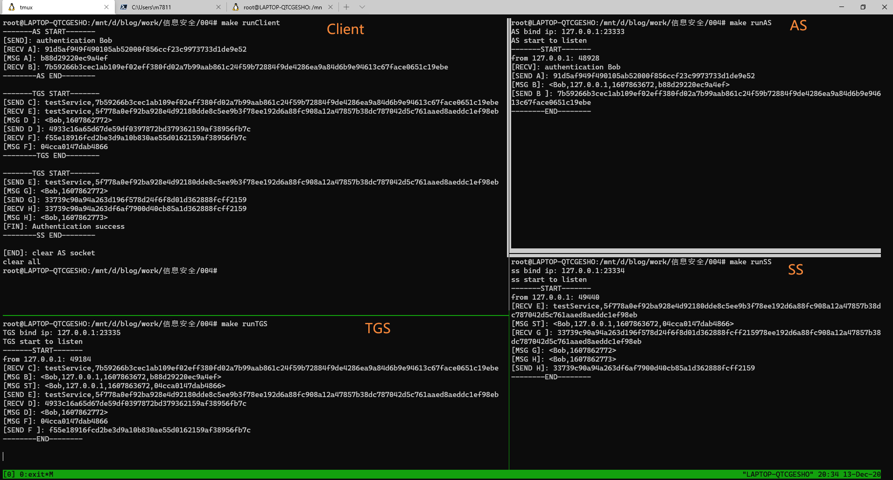

# Kerberos 报告

- 米家龙
- 计算机学院
- 18342075

[TOC]

## 原理概述

> 客户端需要按顺序分别从如下服务器/进程进行验证：
>
> - AS
> - TGS
> - SS

存在如下密钥：

- $\tt{K_{Client}}$ 应用于 client 和 AS 之间的**主密钥**
- $\tt{K_{TGS}}$ 应用于 TGS 和 AS 之间的**对称密钥**
- $\tt{K_{SS}}$ 应用于 SS 和 TGS 之间的**对称密钥**
- $\tt{K_{Client-TGS}}$ 应用于 client 和 TGS 之间的**会话密钥**
- $\tt{K_{Client-SS}}$ 应用于 client 和 SS 之间的**会话密钥**

加密解密函数：

- $\tt{E(K, -)}$ 使用 K 作为密钥进行加密
- $\tt{D(K, -)}$ 使用 K 作为密钥进行解密

### AS

1. client 向 AS 发送明文消息作为请求（带 clientID )
2. AS 检查接收到的消息是否符合要求，并且检查 clientID 是否有效：
   - 如果无效：结束会话
   - 如果有效：返回如下两条消息：
     1. 消息 A ：$\tt{E(K_{Client}, K_{Client-TGS})}$
     2. 消息 B ：$\tt{E(K_{TGS}, <client \ ID, client \ address, validity, K_{Client-TGS}>)}$
        - 消息 B 是用 TGS 密钥加密的票据授权票据 TGT，包括客户 ID、客户网络地址、票据有效期、 Client-TGS 会话密钥。（需要注意 client 无法解密消息 B ）
3. Client 收到消息 A 和 B 后，应用 $\tt{D(K_{Client}, A)}$ 得到 $\tt{K_{Client-TGS}}$ 用于后续与 TGS 的通信。Client 将凭借消息 B 携带的有效的 TGT 向 TGS 证明其身份。

### TGS

1. 申请服务时，Client 向 TGS 发送以下两条消息：
   1. 消息 C：$\tt{service ID, B}$
   2. 消息 D：$\tt{E(K_{Client-TGS} , <client \ ID, timestamp>)}$
      - 消息 D 是用 $\tt{K_{Client-TGS}}$ 会话密钥加密的认证。
2. TGS 从消息 C 中获得消息 B，应用 D(KTGS , B) 得到 KClient-TGS，再应用 D(KClient-TGS , D) 得到认证内容，并返回给 Client 两条消息：
   1. 消息 E：service ID, ST
      - $\tt{ST = E(K_{SS} , <client \ ID, client \ net \ address, validity, K_{Client-SS}>)}$ 称为服务票据，包括客户 ID、客户网络地址、票据有效期限、 Client-SS 会话密钥。
   2. 消息 F：$\tt{E(K_{Client-TGS} , K_{Client-SS})}$ 注意到 Client 无法解密服务票据 ST。

### SS

1. Client 应用 $\tt{D(K_{Client-TGS} , F)}$ 得到 $\tt{K_{Client-SS}}$，然后向 SS 发出以下两条消息：
   1. 消息 E：由先前步骤得到的 $\tt{service ID, ST}$
   2. 消息 G：$\tt{E(K_{Client-SS} , <client \ ID, timestamp>)}$
      - 消息 G 是用 $\tt{K_{Client-SS}}$ 会话密钥加密的一个新的认证。
2. SS 应用 $\tt{D(K_SS , ST)}$ 解密得到 $\tt{K_{Client-SS}}$，再应用 $\tt{D(K_{Client-SS} , G)}$ 解密得到认证 G，然后从中提取时间戳 $\tt{TS = timestamp}$，返回 Client 一条消息 H 作为确认函以确认客户的身份真实，同意向该客户提供服务：
   1. 消息 H：$\tt{E(K_{Client-SS} , <client \ ID, TS+1>)}$
3. Client 应用 $\tt{D(K_{Client-SS} , H)}$ 解密消息 H。如果其中的时间戳被正确
   更新，则 SS 可以信赖，Client 可以向 SS 发送服务请求。
4. 认证过程至此结束，SS 向 Client 客户机提供其所请求的服务

## 总体结构设计

文件划分如下：

- `src/`
  - `client.c` 客户端源代码
  - `AS.c` AS 源代码
  - `SS.c` SS 源代码
  - `TGS.c` TGS 源代码
  - `des.c` des 加密代码
- `keyClient` 储存 $\tt{K_{Client}}$ 的文件
- `keySS` 储存 $\tt{K_{SS}}$ 的文件
- `keyTGS` 储存 $\tt{K_{TGS}}$ 的文件
- `makefile`

## 模块分解

> 主要分为三个模块：
>
> - des 相关代码
> - 客户端相关代码
> - 认证服务器/进程相关代码（除了具体步骤之外，其他部分大同小异）

### Des 模块

该模块主要负责加密解密，基本沿用原本的 des 代码，部分函数有修改，并且新增部分函数。

### Client 模块

主要分成三个部分：

1. 和 AS 通信
2. 和 TGS 通信
3. 和 SS 通信

### 认证服务模块

需要以下步骤，各个认证模块大体相同:

1. 开启服务器并且监听，循环阻塞等待连接和通信：
   - 等待到连接后：
     1. 继续循环等待有效传输：
     2. 对有效传输进行处理（该部分细节模块直接不同）

## 数据结构设计

### Des 相关

主要应用函数如下：

```cpp
/**
 * 一个完整的解密流程
 * @param encodedStr char* 需要解密的字符串
 * @param encodedStrLen int 需要解密的字符串长度
 * @param decodedStr char* 解密后的字符串
 * @param key char* 解密用的密钥
 * @return 返回解密后的字符串长度
*/
int decodeFull(char *encodedStr, int encodedStrLen, char *decodedStr, char key[17]);

/**
 * 一个完整的加密流程
 * @param srcStr char* 需要加密的字符串
 * @param srcStrLen int 需要加密的字符串长度
 * @param encodedStr char* 加密后的字符串
 * @param key char* 加密用的密钥
 * @return 返回加密后的字符串长度
*/
int encodeFull(char *srcStr, int srcStrLen, char *encodedStr, char key[17]);

/**
 * 将字符串转换为以十六进制显示的字符串
 * char a = \x1\x2\x3\x4\x5\x6\x7\x8
 * 转换为
 * char a1 = \x1\x2\x3\x4
 * char a2 = \x5\x6\x7\x8
 * @param src char* 需要转换的字符串
 * @param srcLen int src 字符串的长度
 * @param dest char* 转换后的字符串
 * @return dest 字符串的长度
*/
int char2intChar(char *src, int srcLen, char *dest);

/**
 * 将以十六进制显示的字符串转换为字符串
 * char a1 = \x1\x2\x3\x4
 * char a2 = \x5\x6\x7\x8
 * 转换为
 * char a = \x1\x2\x3\x4\x5\x6\x7\x8
 * @param src char* 需要转换的字符串
 * @param srcLen int src 字符串的长度
 * @param dest char* 转换后的字符串
 * @return dest 字符串的长度
*/
int intChar2char(char *src, int srcLen, char *dest);
```

> 需要注意的是：由于加密后数据是使用 0~255 的数字来储存进字符中的字符串，并且由于有 0 的存在，因此无法直接通过 `printf()` 函数来进行显示，需要选择将一个字符转换成两个字符的 16 进制来显示

### 客户端模块

声明了如下宏和函数：

```cpp
#define AS_HOST "127.0.0.1"
#define SS_HOST "127.0.0.1"
#define TGS_HOST "127.0.0.1"
#define AS_PORT 23333
#define SS_PORT 23334
#define TGS_PORT 23335

/**
 * 新建 socket
 * @param addr char* 目标 ip
 * @param port int 目标 ip 的端口
 * @return sockaddr_in 结构体
*/
struct sockaddr_in *newSockaddr_in(char *addr, int port);

/**
 * 判断响应是否有效
 * @param response char* 响应字符串
 * @return 0 为有效，1 为无效
*/
int isInvalid(char *response);
```

客户端主函数结构如下：

```cpp
int main(int argc, char **argv)
{
  if (argc != 2)
  {
    printf("usage: ./client keyClientFile\n");
    return 0;
  }
  else
  {
    // 获取主密钥

    // 定义相关变量

    // AS
    {
      printf("-------AS START-------\n");
      // 新建套接字

      // 尝试连接

      // 发送第一次明文请求

      // 收到响应
      // 判断响应是否有效

      // 消息 A
      // 消息 A 的解密

      // 收到消息 B
      // 判断响应是否有效

      // 储存消息 B
      printf("--------AS END--------\n\n");
    }

    // TGS
    {
      printf("-------TGS START-------\n");
      // 新建套接字

      // 尝试连接

      // 发送消息 C

      // 收到消息 C
      // 判断响应是否有效

      // 储存 E

      // 生成消息 D
      // 加密消息 D
      // 发送 D

      // 收到响应（消息 F）
      // 判断响应是否无效
      // 解码消息 F
      printf("--------TGS END--------\n\n");
    }

    // SS
    {
      printf("-------TGS START-------\n");
      // 新建套接字

      // 尝试连接

      // 发送消息 E

      // 避免粘包，进行一次无效接受

      // 生成消息 G
      // 加密消息 G
      // 发送消息 G

      // 收到响应（消息 H）
      // 判断响应是否有效
      // 解码消息 H

      // 判断是否认证成功
      if (timestamp == now + 1l && strcmp(clientID_in_H, clientUser) == 0)
      {
        printf("[FIN]: Authentication success\n");
      }
      else
      {
        printf("[ERROR]: Authentication failed\n");
      }
      printf("--------SS END--------\n\n");
    }

    printf("[END]: clear AS socket\n");

    printf("clear all\n");
    return 0;
  }
}
```

### 认证模块

认证模块的基础结构一样，具体如下：

```cpp
/**
 * 新建 socket
 * @param addr char* 目标 ip
 * @param port int 目标 ip 的端口
 * @return sockaddr_in 结构体
*/
struct sockaddr_in *newSockaddr_in(char *addr, int port);

/**
 * 对接收到到的请求进行处理
 * @param clientAddr struct sockaddr_in* 客户端地址
 * @param clientSock int 客户端套接字
*/
void serve(struct sockaddr_in *clientAddr, int clientSock);

int main()
{
  // 申请套接字
  if ((AS_socket = socket(AF_INET, SOCK_STREAM, 0)) < 0)
  {
    // 报错并退出
  }
  else
  {
    // 生对应地址结构体

    // 进行地址和端口绑定

    // 开始监听

    // 阻塞式接受
    while (1)
    {
      struct sockaddr_in clientAddr; // 客户端
      socklen_t clientAddrSize = sizeof(clientAddr);
      int clientSock;

      // 如果接收到了
      if ((clientSock = accept(AS_socket, (struct sockaddr *)&clientAddr, &clientAddrSize)) >= 0)
      {
        // 新建子进程用于处理请求
        int pid = fork();
        if (pid == 0)
        {
          printf("-------START-------\n");
          serve(&clientAddr, clientSock);
          printf("--------END--------\n\n");
          return 0;
        }
      }
    }
    close(AS_socket);
  }
  return 0;
}

```

而对于不同的认证服务，需要有不用的 `serve` 函数进行处理，如下：

#### AS

##### 拓展

该模块需要在基础结构上新增如下宏和变量和函数：

```cpp
#define AS_HOST "127.0.0.1"
#define AS_PORT 23333

#define INVALIDID "Invalid ID"
#define INVALIDREQUEST "Invalid request"

const char username[] = "Bob";
const char clientIDList[][200] = {
    "Bob",
    "Alice"}; // 客户端 ID 的列表
const char clientIDListLen = 2;

/**
 * 检查是否含有对应的客户端 ID
 * @param clientID char* 客户端 ID 的字符串
 * @return 0 存在 1 不存在
*/
int checkClientIDList(char *clientID);

/**
 * 随机生成 key_client_TGS
*/
void getKeyCTGS(char res[17]);
```

##### `serve`

处理请求的 `serve` 函数代码分解如下：

```cpp
void serve(struct sockaddr_in *clientAddr, int clientSock)
{
  char request[1024]; // 请求

  // 显示请求方的相关信息
  printf("from %s: %d\n", inet_ntoa(clientAddr->sin_addr), clientAddr->sin_port);
  int reqLen = read(clientSock, request, 1024);

  // 循环等待请求

  // 判断请求是否有效
  // 无效 ID
  if (reqArgsNum <= 0)
  {
    printf("[SEND]: %s\n", INVALIDREQUEST);
    write(clientSock, INVALIDREQUEST, strlen(INVALIDREQUEST));
    return;
  }
  // ID 不存在
  else if (checkClientIDList(clientID))
  {
    printf("[SEND]: %s\n", INVALIDID);
    write(clientSock, INVALIDID, strlen(INVALIDID));
    return;
  }

  // 如果 ID 有效，需要通过 keyClient 加密暂时生成的会话密钥 key_client_TGS

  // 获取 keyClient

  // 生成 key_client_TGS

  // 生成消息 A
  // 加密消息 A
  // 发送消息 A

  // 获取 keyTGS

  // 生成消息 B
  // 加密消息 B
  // 发送消息 B

  close(clientSock);
  return;
}
```

#### TGS

##### 拓展

该模块需要在基础结构上新增如下宏和变量和函数：

```cpp
#define TGS_HOST "127.0.0.1"
#define TGS_PORT 23335

#define INVALIDID "Invalid (client or service)ID"
#define INVALIDREQUEST "Invalid request"
#define INVALIDADDRESS "Invalid address"
#define INVALIDTIME "Invalid time"

const char username[] = "Bob";
const char clientIDList[][200] = {
    "Bob",
    "Alice"}; // 客户端 ID 的列表

const char serviceIDList[][200] = {
    "testService",
    "service"};
const char clientIDListLen = 2;
const char serviceIDListLen = 2;

/**
 * 检查是否含有对应的客户端 ID
 * @param clientID char* 客户端 ID 的字符串
 * @return 0 存在 1 不存在
*/
int checkClientIDList(char *clientID);

/**
 * 生成 key_client_SS
*/
void getKeyCSS(char res[17]);

/**
 * 检查服务 ID 是否存在
 * @param serviceID char* 服务 ID 字符串
 * @return 0 存在 1 不存在
*/
int checkServiceIDList(char *serviceID);
```

##### `serve`

处理请求的 `serve` 函数代码分解如下：

```cpp
void serve(struct sockaddr_in *clientAddr, int clientSock)
{
  char request[1024]; // 请求

  // 获取 key_TGS
  FILE *keyTGSFile = fopen("./keyTGS", "r");
  char keyTGS[17];
  fread(keyTGS, 1, 17, keyTGSFile);

  // 显示请求方的相关信息
  printf("from %s: %d\n", inet_ntoa(clientAddr->sin_addr), clientAddr->sin_port);

  // 循环等待请求
  // 判断请求是否有效

  // 解码消息 B
  // 判断消息 B 是否有效

  // 获取密钥 keySS

  // 生成 key_client_SS

  // 生成 ST
  // 加密 ST
  // 生成消息 E
  // 发送消息 E

  // 接收请求（消息 D）
  // 判断请求有效性

  // 解密 D
  // 判断消息 D 的有效性

  // 生成消息 F
  // 加密消息 F
  // 发送消息 F

  close(clientSock);
  fclose(keySSFile);
  fclose(keyTGSFile);
  return;
}
```

#### SS

##### 拓展

该模块需要在基础结构上新增如下宏和变量和函数：

```cpp
#define SS_HOST "127.0.0.1"
#define SS_PORT 23334

#define INVALIDID "Invalid (client or service)ID"
#define INVALIDREQUEST "Invalid request"
#define INVALIDADDRESS "Invalid address"
#define INVALIDTIME "Invalid time"

const char username[] = "Bob";
const char clientIDList[][200] = {
    "Bob",
    "Alice"}; // 客户端 ID 的列表

const char serviceIDList[][200] = {
    "testService",
    "service"};
const char clientIDListLen = 2;
const char serviceIDListLen = 2;

/**
 * 检查是否含有对应的客户端 ID
 * @param clientID char* 客户端 ID 的字符串
 * @return 0 存在 1 不存在
*/
int checkClientIDList(char *clientID);

/**
 * 生成 key_client_SS
*/
void getKeyCSS(char res[17]);

/**
 * 检查是否含有对应的服务 ID
 * @param serviceID char* 客户端 ID 的字符串
 * @return 0 存在 1 不存在
*/
int checkServiceIDList(char *serviceID);
```

##### `serve`

处理请求的 `serve` 函数代码分解如下：

```cpp
void serve(struct sockaddr_in *clientAddr, int clientSock)
{
  char request[1024]; // 请求

  // 显示请求方的相关信息

  // 循环等待请求
  // 判断请求有效性

  // 得到消息 E
  // 获取 key_SS
  // 解密 ST
  // 判断 ST 有效性

  // 避免粘包，进行一次无效发送
  write(clientSock, "RECV G", 1024);

  // 接收请求（消息 G）
  // 判断请求有效性

  // 得到消息 G
  // 解密消息 G
  // 验证消息 G 的有效性

  // 生成消息 H
  // 加密消息 H
  // 发送消息 H

  free(keySSFile);
  close(clientSock);
  return;
}
```

## 编译运行结果

### 运行环境

运行环境为 WSL

```bash
root@LAPTOP-QTCGESHO:/mnt/c/Users/m7811# uname -a
Linux LAPTOP-QTCGESHO 4.4.0-19041-Microsoft #488-Microsoft Mon Sep 01 13:43:00 PST 2020 x86_64 x86_64 x86_64 GNU/Linux

root@LAPTOP-QTCGESHO:/mnt/c/Users/m7811# lsb_release -a
No LSB modules are available.
Distributor ID: Ubuntu
Description:    Ubuntu 18.04.5 LTS
Release:        18.04
Codename:       bionic
```

使用 makefile 进行编译运行，makefile 代码如下：

```makefile
# 编译器
GCC := gcc
# 源代码文件
SRC := ./src
# client 代码
CLIENT := client.c
# TGS 代码
TGS := TGS.c
# SS 代码
SS := SS.c
# AS 代码
AS := AS.c
# des 加密
DES := des.c
# 主密钥文件
KEY_CLIENT := ./keyClient

all: client AS SS TGS

client: ${SRC}/${CLIENT} ${SRC}/${DES}
	${GCC} $< -o $@

TGS: ${SRC}/${TGS} ${SRC}/${DES}
	${GCC} $< -o $@

AS: ${SRC}/${AS} ${SRC}/${DES}
	${GCC} $< -o $@

SS: ${SRC}/${SS} ${SRC}/${DES}
	${GCC} $< -o $@

.PHONY: clean runClient runAS runSS runTGS
clean:
	-@rm client TGS AS SS desTest

runClient: client
	./$< ${KEY_CLIENT}

runAS: AS
	./$<

runSS: SS
	./$<

runTGS: TGS
	./$<
```

### 运行结果

> 由于认证过程中能够导致失败的干扰因素比较多，因此只进行一次认证成功的结果展示
>
> 运行该 kerberos 需要开四个终端页面

1. 先运行 AS, TGS, SS 等待请求
2. 使用 `make runClient` 进行客户端认证，得到结果如下图：

client：



AS：



TGS：



SS：



完整页面截图如下：



## C 语言源代码

> 代码量较大，建议直接查看源代码文件

### `des.c`

```cpp
#include <stdio.h>
#include <stdlib.h>
#include <stdbool.h>
#include <ctype.h>
#include <string.h>

#define BLOCK64 64         // 01位块长度
#define BLOCK8 9           // 8字节明文块长度，由于字符串限制，必须+1
#define EEXTAND 48         // E-拓展串
#define SUBKEYLEN 48       // 子密钥长度
#define SUBKEYNUM 16       // 子密钥数量
#define KEYLEN 64          // 密钥长度
#define NOCHECKDIGITLEN 56 // 非校验位长度

typedef bool des1_t;
typedef unsigned char des8_t;

// IP 置换表
const int IP_TABLE[BLOCK64] = {
    58, 50, 42, 34, 26, 18, 10, 2,
    60, 52, 44, 36, 28, 20, 12, 4,
    62, 54, 46, 38, 30, 22, 14, 6,
    64, 56, 48, 40, 32, 24, 16, 8,
    57, 49, 41, 33, 25, 17, 9, 1,
    59, 51, 43, 35, 27, 19, 11, 3,
    61, 53, 45, 37, 29, 21, 13, 5,
    63, 55, 47, 39, 31, 23, 15, 7};

// IP逆 置换表
const int IP_TABLE_REVERSE[BLOCK64] = {
    40, 8, 48, 16, 56, 24, 64, 32,
    39, 7, 47, 15, 55, 23, 63, 31,
    38, 6, 46, 14, 54, 22, 62, 30,
    37, 5, 45, 13, 53, 21, 61, 29,
    36, 4, 44, 12, 52, 20, 60, 28,
    35, 3, 43, 11, 51, 19, 59, 27,
    34, 2, 42, 10, 50, 18, 58, 26,
    33, 1, 41, 9, 49, 17, 57, 25};

// P-置换
const int P_TABLE[BLOCK64 / 2] = {
    16, 7, 20, 21,
    29, 12, 28, 17,
    1, 15, 23, 26,
    5, 18, 31, 10,
    2, 8, 24, 14,
    32, 27, 3, 9,
    19, 13, 30, 6,
    22, 11, 4, 25};

// PC-1 置换表
const int PC_1_TABLE[NOCHECKDIGITLEN] = {
    // C0
    57, 49, 41, 33, 25, 17, 9,
    11, 58, 50, 42, 34, 26, 18,
    10, 2, 59, 51, 43, 35, 27,
    19, 11, 3, 60, 52, 44, 36,

    // D0
    63, 55, 47, 39, 31, 23, 15,
    7, 62, 54, 46, 38, 30, 22,
    14, 6, 61, 53, 45, 37, 29,
    21, 13, 5, 28, 20, 12, 4};

// PC-2 置换表
const int PC_2_TABLE[SUBKEYLEN] = {
    14, 17, 11, 24, 1, 5,
    3, 28, 15, 6, 21, 10,
    23, 19, 12, 4, 26, 8,
    16, 7, 27, 20, 13, 2,

    41, 52, 31, 37, 47, 55,
    30, 40, 51, 45, 33, 48,
    44, 49, 39, 56, 34, 53,
    46, 42, 50, 36, 29, 32};

// S 盒
const int S_BOX[][BLOCK64] = {
    {14, 4, 13, 1, 2, 15, 11, 8, 3, 10, 6, 12, 5, 9, 0, 7,
     0, 15, 7, 4, 14, 2, 13, 1, 10, 6, 12, 11, 9, 5, 3, 8,
     4, 1, 14, 8, 13, 6, 2, 11, 15, 12, 9, 7, 3, 10, 5, 0,
     15, 12, 8, 2, 4, 9, 1, 7, 5, 11, 3, 14, 10, 0, 6, 13},

    {15, 1, 8, 14, 6, 11, 3, 4, 9, 7, 2, 13, 12, 0, 5, 10,
     3, 13, 4, 7, 15, 2, 8, 14, 12, 0, 1, 10, 6, 9, 11, 5,
     0, 14, 7, 11, 10, 4, 13, 1, 5, 8, 12, 6, 9, 3, 2, 15,
     13, 8, 10, 1, 3, 15, 4, 2, 11, 6, 7, 12, 0, 5, 14, 9},

    {10, 0, 9, 14, 6, 3, 15, 5, 1, 13, 12, 7, 11, 4, 2, 8,
     13, 7, 0, 9, 3, 4, 6, 10, 2, 8, 5, 14, 12, 11, 15, 1,
     13, 6, 4, 9, 8, 15, 3, 0, 11, 1, 2, 12, 5, 10, 14, 7,
     1, 10, 13, 0, 6, 9, 8, 7, 4, 15, 14, 3, 11, 5, 2, 12},

    {7, 13, 14, 3, 0, 6, 9, 10, 1, 2, 8, 5, 11, 12, 4, 15,
     13, 8, 11, 5, 6, 15, 0, 3, 4, 7, 2, 12, 1, 10, 14, 9,
     10, 6, 9, 0, 12, 11, 7, 13, 15, 1, 3, 14, 5, 2, 8, 4,
     3, 15, 0, 6, 10, 1, 13, 8, 9, 4, 5, 11, 12, 7, 2, 14},

    {2, 12, 4, 1, 7, 10, 11, 6, 8, 5, 3, 15, 13, 0, 14, 9,
     14, 11, 2, 12, 4, 7, 13, 1, 5, 0, 15, 10, 3, 9, 8, 6,
     4, 2, 1, 11, 10, 13, 7, 8, 15, 9, 12, 5, 6, 3, 0, 14,
     11, 8, 12, 7, 1, 14, 2, 13, 6, 15, 0, 9, 10, 4, 5, 3},

    {12, 1, 10, 15, 9, 2, 6, 8, 0, 13, 3, 4, 14, 7, 5, 11,
     10, 15, 4, 2, 7, 12, 9, 5, 6, 1, 13, 14, 0, 11, 3, 8,
     9, 14, 15, 5, 2, 8, 12, 3, 7, 0, 4, 10, 1, 13, 11, 6,
     4, 3, 2, 12, 9, 5, 15, 10, 11, 14, 1, 7, 6, 0, 8, 13},

    {4, 11, 2, 14, 15, 0, 8, 13, 3, 12, 9, 7, 5, 10, 6, 1,
     13, 0, 11, 7, 4, 9, 1, 10, 14, 3, 5, 12, 2, 15, 8, 6,
     1, 4, 11, 13, 12, 3, 7, 14, 10, 15, 6, 8, 0, 5, 9, 2,
     6, 11, 13, 8, 1, 4, 10, 7, 9, 5, 0, 15, 14, 2, 3, 12},

    {13, 2, 8, 4, 6, 15, 11, 1, 10, 9, 3, 14, 5, 0, 12, 7,
     1, 15, 13, 8, 10, 3, 7, 4, 12, 5, 6, 11, 0, 14, 9, 2,
     7, 11, 4, 1, 9, 12, 14, 2, 0, 6, 10, 13, 15, 3, 5, 8,
     2, 1, 14, 7, 4, 10, 8, 13, 15, 12, 9, 0, 3, 5, 6, 11}};

// E-拓规则（比特-选择表）
const int E_EXTAND[SUBKEYLEN] = {
    32, 1, 2, 3, 4, 5,
    4, 5, 6, 7, 8, 9,
    8, 9, 10, 11, 12, 13,
    12, 13, 14, 15, 16, 17,
    16, 17, 18, 19, 20, 21,
    20, 21, 22, 23, 24, 25,
    24, 25, 26, 27, 28, 29,
    28, 29, 30, 31, 32, 1};

des8_t block8[BLOCK8];           // 明文
des8_t encodedBlock8[BLOCK8];    // 加密后的明文
des1_t block64[BLOCK64];         // 二进制明文
des1_t encodedBlock64[BLOCK64];  // 加密后的二进制明文
des1_t encodingBlock64[BLOCK64]; // 加密中的二进制明文
des1_t decodedBlock64[BLOCK64];  // 解密后的二进制明文
des8_t decodedBlock8[BLOCK8];    // 解密后的明文
des1_t decodingBlock64[BLOCK64]; // 解密中的二进制明文

char InitKey[KEYLEN / 4 + 1];        // 16进制的输入
des1_t Key[BLOCK64];                 // 密钥
des1_t Subkey[SUBKEYNUM][SUBKEYLEN]; // 子密钥

FILE *readFile; // 读取的文件

/**
 * 通过密钥生成子密钥，总共生成16个
 * @param K des1_t* 64位密钥
*/
void getSubkey(des1_t *K);

/**
 * 8字节 转换成 64位
 * @param from des8_t* 源数组
 * @param to des1_t* 目标数组
*/
void block8ToBlock64(des8_t *from, des1_t *to);

/**
 * 64位 转换为 8字节
 * @param from des1_t* 源数组
 * @param to des8_t* 目标数组
*/
void block64ToBlock8(des1_t *from, des8_t *to);

/**
 * 通过初始获取的密钥进行转换
*/
void getKey();

/**
 * 轮函数
 * @param Ri des1_t*
 * @param iterationNum int 迭代次数
 * @return 一个32位数组指针
*/
des1_t *Feistel(des1_t *Ri, int iteraionNum);

/**
 * 块加密
*/
void encodeBlock();

/**
 * 块解密
*/
void decodeBlock();

/**
 * 加密
*/
int encode(char *srcStr, int srcStrLen, char *encodedStr);

/**
 * 解密
*/
int decode(char *encodedStr, int encodeStrLen, char *decodedStr);

/**
 * 一个完整的解密流程
 * @param encodedStr char* 需要解密的字符串
 * @param encodedStrLen int 需要解密的字符串长度
 * @param decodedStr char* 解密后的字符串
 * @param key char* 解密用的密钥
 * @return 返回解密后的字符串长度
*/
int decodeFull(char *encodedStr, int encodedStrLen, char *decodedStr, char key[17]);

/**
 * 一个完整的加密流程
 * @param srcStr char* 需要加密的字符串
 * @param srcStrLen int 需要加密的字符串长度
 * @param encodedStr char* 加密后的字符串
 * @param key char* 加密用的密钥
 * @return 返回加密后的字符串长度
*/
int encodeFull(char *srcStr, int srcStrLen, char *encodedStr, char key[17]);

/**
 * 将字符串转换为以十六进制显示的字符串
 * char a = \x1\x2\x3\x4\x5\x6\x7\x8
 * 转换为
 * char a1 = \x1\x2\x3\x4
 * char a2 = \x5\x6\x7\x8
 * @param src char* 需要转换的字符串
 * @param srcLen int src 字符串的长度
 * @param dest char* 转换后的字符串
 * @return dest 字符串的长度
*/
int char2intChar(char *src, int srcLen, char *dest);

/**
 * 将以十六进制显示的字符串转换为字符串
 * char a1 = \x1\x2\x3\x4
 * char a2 = \x5\x6\x7\x8
 * 转换为
 * char a = \x1\x2\x3\x4\x5\x6\x7\x8
 * @param src char* 需要转换的字符串
 * @param srcLen int src 字符串的长度
 * @param dest char* 转换后的字符串
 * @return dest 字符串的长度
*/
int intChar2char(char *src, int srcLen, char *dest);

/**
 * 重置所有数组
*/
void clearDes()
{
  for (int i = 0; i < 8; i++)
  {
    block8[i] = encodedBlock8[i] = decodedBlock8[i] = 0;
  }

  for (int i = 0; i < 64; i++)
  {
    block64[i] = encodedBlock64[i] = decodedBlock64[i] =
        Key[i] = encodingBlock64[i] = decodingBlock64[i] = 0;
  }

  for (int i = 0; i < 16; i++)
  {
    InitKey[i] = 0;
    for (int j = 0; j < SUBKEYLEN; j++)
    {
      Subkey[i][j] = 0;
    }
  }

  InitKey[16] = 0;
  return;
}

int encodeFull(char *srcStr, int srcStrLen, char *encodedStr, char key[17])
{
  strcpy(InitKey, key);
  getKey();
  getSubkey(Key);
  int res = encode(srcStr, srcStrLen, encodedStr);
  clearDes();
  return res;
}

int decodeFull(char *encodedStr, int encodeStrLen, char *decodedStr, char key[17])
{
  strcpy(InitKey, key);
  getKey();
  getSubkey(Key);
  int res = decode(encodedStr, encodeStrLen, decodedStr);

  // printf("decodeFull: %s\n", decodedStr);
  clearDes();
  // return &decodedStr;
  return res;
}

int decode(char *encodedStr, int encodeStrLen, char *decodedStr)
{
  int blockNum = encodeStrLen / 8 + (encodeStrLen % 8 == 0 ? 0 : 1);

  for (int t = 0; t < blockNum; t++)
  {
    int len = 0;
    for (int j = 0; j < 8 && (j + t * 8) < encodeStrLen; j++)
    {
      encodedBlock8[j] = encodedStr[j + t * 8];
      len = j;
    }
    encodedBlock8[len + 1] = 0;
    block8ToBlock64(encodedBlock8, encodedBlock64);
    decodeBlock();
    block64ToBlock8(decodedBlock64, decodedBlock8);

    // 去除填充
    decodedBlock8[8] = 0;
    int tail = decodedBlock8[7]; // 看末尾那位是否是填充的
    bool isPadding = true;
    for (int i = 8 - tail; i < BLOCK8 - 1; i++)
    {
      if (decodedBlock8[i] != tail) // 不是填充
      {
        isPadding = false;
        break;
      }
    }

    if (isPadding)
    {
      decodedBlock8[8 - tail] = 0;
    }

    for (int i = 0; i < 8; i++)
    {
      decodedStr[t * 8 + i] = decodedBlock8[i];
    }

    // printf("%s\n%s\n", decodedBlock8, decodedStr);
  }

  // printf("decode end: %s\n", decodedStr);

  return strlen(decodedStr);
}

int encode(char *srcStr, int srcStrLen, char *encodedStr)
{

  int blockNum = srcStrLen / 8 + 1;

  bool padding = false; // 判定是否已经补全
  int len = 0;
  int count = 0;

  // printf("start to loop\n");
  for (int t = 0; t < blockNum; t++)
  {
    int len = 0;
    for (int j = 0; j < 8 && (j + t * 8) < srcStrLen; j++)
    {
      block8[j] = srcStr[j + t * 8];
      len = j + 1;
    }
    block8[len] = 0;
    // len = fread(block8, 1, 8, readFile);
    // block8[len ] = 0;
    // printf("%s\n", block8);
    if (len < 8)
    {
      for (int i = len; i < 8; i++)
      {
        block8[i] = 8 - len; // 填充
      }
      block8[8] = 0;
      padding = true;
    }
    block8ToBlock64(block8, block64);
    encodeBlock();
    block64ToBlock8(encodedBlock64, encodedBlock8);

    for (int i = 0; i < 8; i++)
    {
      encodedStr[count++] = encodedBlock8[i];
    }
  }

  // 如果刚好输入完成，那么需要补一个块
  if (!padding)
  {
    for (int i = 0; i < 8; i++)
    {
      block8[i] = 0x08;
    }
    block8[8] = 0;
    block8ToBlock64(block8, block64);
    encodeBlock();
    block64ToBlock8(encodedBlock64, encodedBlock8);
    for (int i = 0; i < 8; i++)
    {
      encodedStr[count++] = encodedBlock8[i];
    }
  }
  return blockNum * 8;
}

void block8ToBlock64(des8_t *from, des1_t *to)
{
  for (int i = 0; i < 8; i++)
  {
    des8_t tmp = from[i];
    for (int j = 0; j < 8; j++)
    {
      to[i * 8 + j] = (tmp >> (7 - j)) & 1;
    }
  }
}

void block64ToBlock8(des1_t *from, des8_t *to)
{
  for (int i = 0; i < 8; i++)
  {
    des8_t tmp = 0;
    for (int j = 0; j < 8; j++)
    {
      tmp = (tmp << 1) + from[i * 8 + j];
    }
    to[i] = tmp;
  }
}

void encodeBlock()
{
  // 初始置换 IP
  for (int i = 0; i < BLOCK64; i++)
  {
    encodingBlock64[i] = block64[IP_TABLE[i] - 1];
  }
  // 16次迭代
  des1_t *Li = encodingBlock64;               // 初始化 L0
  des1_t *Ri = encodingBlock64 + BLOCK64 / 2; // 初始化 R0

  for (int i = 0; i < BLOCK64 / 4; i++)
  {
    des1_t *tmp = Feistel(Ri, i); // 轮函数结果
    des1_t L_tmp, R_tmp;
    for (int j = 0; j < BLOCK64 / 2; j++)
    {
      L_tmp = Ri[j];
      R_tmp = Li[j] ^ tmp[j];

      Li[j] = L_tmp;
      Ri[j] = R_tmp;
    }
  }

  // 交换置换
  for (int i = 0; i < BLOCK64 / 2; i++)
  {
    des1_t tmp = Li[i];
    Li[i] = Ri[i];
    Ri[i] = tmp;
  }
  for (int i = 0; i < BLOCK64; i++)
  {
    encodedBlock64[i] = encodingBlock64[IP_TABLE_REVERSE[i] - 1];
  }
}

des1_t *Feistel(des1_t *Ri, int iteraionNum)
{
  // E 拓展
  des1_t e_extand[48]; // E 拓展结果
  for (int i = 0; i < EEXTAND; i++)
  {
    e_extand[i] = Ri[E_EXTAND[i] - 1];
  }

  des1_t xorList[48]; // 异或的结果
  for (int i = 0; i < EEXTAND; i++)
  {
    xorList[i] = e_extand[i] ^ Subkey[iteraionNum][i];
  }

  // S 盒压缩
  des1_t s_box_res[32]; // S 盒压缩结果
  for (int i = 0; i < 8; i++)
  {
    int n = (xorList[i * 6] << 1) + xorList[i * 6 + 5];                                                             // 确定行号
    int m = (xorList[i * 6 + 1] << 3) + (xorList[i * 6 + 2] << 2) + (xorList[i * 6 + 3] << 1) + xorList[i * 6 + 4]; // 获取列号

    des8_t res = S_BOX[i][n * BLOCK64 / 4 + m];

    for (int j = 0; j < 4; j++)
    {
      s_box_res[i * 4 + j] = (res >> (3 - j)) & 1;
    }
  }

  static des1_t p_res[BLOCK64 / 2]; // P 置换的结果
  for (int i = 0; i < BLOCK64 / 2; i++)
  {
    p_res[i] = s_box_res[P_TABLE[i] - 1];
  }

  return p_res;
}

void getKey()
{
  for (int i = 0; i < 16; i++)
  {
    int moveBit = i % 2 == 0 ? 4 : 0;
    int tmp = InitKey[i] = tolower(InitKey[i]);
    if (isdigit(tmp))
    {
      tmp -= '0';
      InitKey[i] = tmp;
    }
    else
    {
      tmp -= ('a' - 10);
      InitKey[i] = tmp;
    }

    for (int j = 0; j < 4; j++)
    {
      Key[i * 4 + j] = (tmp >> (3 - j)) & 1;
    }
  }
}

void getSubkey(des1_t *K)
{

  // 进行初始的 PC-1 置换
  des1_t CD[NOCHECKDIGITLEN];
  for (int i = 0; i < NOCHECKDIGITLEN; i++)
  {
    CD[i] = K[PC_1_TABLE[i] - 1];
  }

  // 循环生成
  for (int i = 0; i < SUBKEYNUM; i++)
  {

    // 进行 LS 操作
    if (i == 0 || i == 1 || i == 8 || i == 15) // 需要循环左移1个位置
    {
      des1_t tmpC = CD[0];                   // 对 C
      des1_t tmpD = CD[NOCHECKDIGITLEN / 2]; // 对 D
      for (int j = 0; j < NOCHECKDIGITLEN / 2 - 1; j++)
      {
        CD[j] = CD[j + 1];
        CD[j + NOCHECKDIGITLEN / 2] = CD[j + NOCHECKDIGITLEN / 2 + 1];
      }
      CD[NOCHECKDIGITLEN / 2 - 1] = tmpC;
      CD[NOCHECKDIGITLEN - 1] = tmpD;
    }
    else // 否则循环左移2个位置
    {
      des1_t tmpC1 = CD[0], tmpC2 = CD[1];
      des1_t tmpD1 = CD[NOCHECKDIGITLEN / 2], tmpD2 = CD[NOCHECKDIGITLEN / 2 + 1];
      for (int j = 0; j < NOCHECKDIGITLEN / 2 - 2; j++)
      {
        CD[j] = CD[j + 2];
        CD[j + NOCHECKDIGITLEN / 2] = CD[j + NOCHECKDIGITLEN / 2 + 2];
      }
      CD[NOCHECKDIGITLEN / 2 - 2] = tmpC1;
      CD[NOCHECKDIGITLEN / 2 - 1] = tmpC2;
      CD[NOCHECKDIGITLEN - 2] = tmpD1;
      CD[NOCHECKDIGITLEN - 1] = tmpD2;
    }

    // PC-2 压缩置换
    for (int j = 0; j < SUBKEYLEN; j++)
    {
      Subkey[i][j] = CD[PC_2_TABLE[j] - 1];
    }
  }
}

void decodeBlock()
{
  // 初始置换 IP
  for (int i = 0; i < BLOCK64; i++)
  {
    decodingBlock64[i] = encodedBlock64[IP_TABLE[i] - 1];
  }
  // 16次迭代
  des1_t *Li = decodingBlock64;               // 初始化 L0
  des1_t *Ri = decodingBlock64 + BLOCK64 / 2; // 初始化 R0

  for (int i = BLOCK64 / 4 - 1; i >= 0; i--)
  {
    des1_t *tmp = Feistel(Ri, i); // 轮函数结果
    des1_t L_tmp, R_tmp;
    for (int j = 0; j < BLOCK64 / 2; j++)
    {
      L_tmp = Ri[j];
      R_tmp = Li[j] ^ tmp[j];

      Li[j] = L_tmp;
      Ri[j] = R_tmp;
    }
  }

  // 交换置换
  for (int i = 0; i < BLOCK64 / 2; i++)
  {
    des1_t tmp = Li[i];
    Li[i] = Ri[i];
    Ri[i] = tmp;
  }

  // 逆置换
  for (int i = 0; i < BLOCK64; i++)
  {
    decodedBlock64[i] = decodingBlock64[IP_TABLE_REVERSE[i] - 1];
  }
}

void printF(char *message, int len)
{
  for (int i = 0; i < len; i++)
  {
    printf("%02x", message[i] & 0xff);
  }
  printf("\n");
}

#define getHex(tmp) ((tmp <= 9 && tmp >= 0) ? (tmp + '0') : (tmp - 10 + 'a'))
#define getHalfChar(tmp) ((tmp <= '9' && tmp >= '0') ? (tmp - '0') : (tmp - 'a' + 10))

int char2intChar(char *src, int srcLen, char *dest)
{
  int tmp;
  for (int i = 0; i < srcLen; i++)
  {
    tmp = ((src[i] & 0xff) >> 4) & 0x0f;
    dest[i * 2] = getHex(tmp);
    tmp = src[i] & 0x0f;
    dest[i * 2 + 1] = getHex(tmp);
    // printf("%d\t%d\t%02x\t%c\t%c\n", ((src[i] & 0xff) >> 4) & 0x0f, src[i] & 0x0f, src[i] & 0xff, dest[i * 2], dest[i * 2 + 1]);
  }

  dest[srcLen * 2] = 0;

  return srcLen * 2;
}

int intChar2char(char *src, int srcLen, char *dest)
{
  for (int i = 0; i < srcLen / 2; i++)
  {
    dest[i] = (getHalfChar(src[i * 2]) << 4) + getHalfChar(src[i * 2 + 1]);
  }

  dest[srcLen / 2] = 0;
  return srcLen / 2;
}
```

### `client.c`

```cpp
#include <sys/stat.h>
#include <fcntl.h>
#include <errno.h>
#include <netdb.h>
#include <sys/types.h>
#include <sys/socket.h>
#include <netinet/in.h>
#include <arpa/inet.h>
#include <stdio.h>
#include <string.h>
#include <stdlib.h>
#include <unistd.h>
#include <time.h>

#include "./des.c"

#define AS_HOST "127.0.0.1"
#define SS_HOST "127.0.0.1"
#define TGS_HOST "127.0.0.1"
#define AS_PORT 23333
#define SS_PORT 23334
#define TGS_PORT 23335

/**
 * 新建 socket
 * @param addr char* 目标 ip
 * @param port int 目标 ip 的端口
 * @return sockaddr_in 结构体
*/
struct sockaddr_in *newSockaddr_in(char *addr, int port);

/**
 * 判断响应是否有效
 * @param response char* 响应字符串
 * @return 0 为有效，1 为无效
*/
int isInvalid(char *response);

struct sockaddr_in *newSockaddr_in(char *addr, int port)
{
  struct sockaddr_in *sockaddr = (struct sockaddr_in *)malloc(sizeof(struct sockaddr_in));
  sockaddr->sin_addr.s_addr = inet_addr(addr);
  sockaddr->sin_family = AF_INET;
  sockaddr->sin_port = htons(port);
  return sockaddr;
}

int main(int argc, char **argv)
{
  if (argc != 2)
  {
    printf("usage: ./client keyClientFile\n");
    return 0;
  }
  else
  {
    // 获取主密钥
    FILE *keyClientFile = fopen(argv[1], "r");
    char keyClient[17];
    fread(keyClient, 1, 16, keyClientFile);

    int clientSock; // 客户端套接字

    const char clientUser[] = "Bob";        // 用户 ID
    const char serviceID[] = "testService"; // 服务 ID

    time_t now;

    char request[1024];  // 请求
    char response[1024]; // 响应
    int resLen;          // 响应字符串长度
    char error[1024];    // 错误相关

    char keyCTGS[17]; // key_client_TGS
    char keyCSS[17];  // key_client_SS

    // 消息 A 相关
    char messageA[1024];
    char messageA_encoded[1027];
    char messageA_decoded[1024];
    int messageA_encoded_Len = 0;

    // 消息 B 相关
    char messageB[1024];

    // 消息 C 相关
    char messageC[1024];

    // 消息 D 相关
    char messageD[1024];
    char messageD_encoded[1024];
    char messageD_encoded_transfered[1024];
    int messageD_encoded_len;

    // 消息 E 相关
    char messageE[1024];
    char messageE_encoded[1024];
    char messageE_decoded[1024];
    char messageE_encoded_len = 0;

    // 消息 F 相关
    char messageF[1024];
    char messageF_encoded[1024];
    char messageF_decoded[1024];
    char messageF_encoded_len = 0;

    // 消息 G 相关
    char messageG[1024];
    char messageG_encoded[1024];
    char messageG_encoded_transfered[1024];
    char messageG_encoded_len = 0;

    // 消息 H 相关
    char messageH[1024];
    char messageH_encoded[1024];
    char messageH_decoded[1024];
    char messageH_encoded_transfered[1024];
    int messageH_encoded_len = 0;

    // AS
    {
      printf("-------AS START-------\n");

      // 新建套接字
      if ((clientSock = socket(AF_INET, SOCK_STREAM, 0)) < 0)
      {
        printf("[ERROR]: client socket failed\n");
        return 1;
      }

      // 尝试连接
      struct sockaddr_in *AS_sockaddr = newSockaddr_in(AS_HOST, AS_PORT);
      if (connect(clientSock, (struct sockaddr *)AS_sockaddr, sizeof(struct sockaddr_in)) < 0)
      {
        printf("[ERROR]: connect AS failed\n");
        return 1;
      }

      // 发送第一次明文请求
      sprintf(request, "authentication %s", clientUser);
      write(clientSock, request, strlen(request));
      printf("[SEND]: %s\n", request);

      // 收到响应
      resLen = read(clientSock, response, 1024);
      response[resLen] = 0;

      // 判断响应是否有效
      if (isInvalid(response))
      {
        close(clientSock);
        free(AS_sockaddr);
        return 1;
      }

      // 消息 A
      printf("[RECV A]: %s\n", response);
      strcpy(messageA, response);

      // 消息 A 的解密
      messageA_encoded_Len = intChar2char(messageA, resLen, messageA_encoded);
      decodeFull(messageA_encoded, messageA_encoded_Len, messageA_decoded, keyClient);
      printf("[MSG A]: %s\n", messageA_decoded);
      strcpy(keyCTGS, messageA_decoded);

      // 收到消息 B
      resLen = read(clientSock, response, 1024);
      response[resLen] = 0;

      // 判断响应是否有效
      if (isInvalid(response))
      {
        close(clientSock);
        free(AS_sockaddr);
        return 1;
      }

      // 储存消息 B
      strcpy(messageB, response);
      printf("[RECV B]: %s\n", messageB);

      close(clientSock);
      free(AS_sockaddr);

      printf("--------AS END--------\n\n");
    }

    // TGS
    {
      printf("-------TGS START-------\n");

      // 新建套接字
      if ((clientSock = socket(AF_INET, SOCK_STREAM, 0)) < 0)
      {
        printf("[ERROR]: client socket failed\n");
        return 1;
      }

      // 尝试连接
      struct sockaddr_in *TGS_sockaddr = newSockaddr_in(TGS_HOST, TGS_PORT);
      if (connect(clientSock, (struct sockaddr *)TGS_sockaddr, sizeof(struct sockaddr)))
      {
        printf("[ERROR]: connect TGS failed\n");
        return 1;
      }

      // 发送消息 C
      sprintf(messageC, "%s,%s", serviceID, messageB);
      printf("[SEND C]: %s\n", messageC);
      write(clientSock, messageC, strlen(messageC));

      // 接受 E
      resLen = read(clientSock, response, 1024);
      response[resLen] = 0;

      // 判断响应是否有效
      if (isInvalid(response))
      {
        close(clientSock);
        free(TGS_sockaddr);
        return 1;
      }

      // 储存 E
      strcpy(messageE, response);
      printf("[RECV E]: %s\n", messageE);

      // 生成消息 D
      now = time(NULL);
      sprintf(messageD, "<%s,%ld>", clientUser, now);
      printf("[MSG D ]: %s\n", messageD);

      // 加密消息 D
      messageD_encoded_len = encodeFull(messageD, strlen(messageD), messageD_encoded, messageA_decoded);
      char2intChar(messageD_encoded, messageD_encoded_len, messageD_encoded_transfered);

      // 发送 D
      write(clientSock, messageD_encoded_transfered, strlen(messageD_encoded_transfered));
      printf("[SEND D ]: %s\n", messageD_encoded_transfered);

      // 收到响应（消息 F）
      resLen = read(clientSock, response, 1024);
      response[resLen] = 0;

      // 判断响应是否无效
      if (isInvalid(response))
      {
        close(clientSock);
        free(TGS_sockaddr);
        return 1;
      }

      // 解码消息 F
      strcpy(messageF, response);
      printf("[RECV F]: %s\n", messageF);
      messageF_encoded_len = intChar2char(messageF, strlen(messageF), messageF_encoded);
      decodeFull(messageF_encoded, messageF_encoded_len, messageF_decoded, keyCTGS);
      printf("[MSG F]: %s\n", messageF_decoded);
      strcpy(keyCSS, messageF_decoded);

      printf("--------TGS END--------\n\n");
    }

    // SS
    {
      printf("-------TGS START-------\n");

      // 新建套接字
      if ((clientSock = socket(AF_INET, SOCK_STREAM, 0)) < 0)
      {
        printf("[ERROR]: client socket failed\n");
        return 1;
      }

      // 尝试连接
      struct sockaddr_in *SS_sockaddr = newSockaddr_in(SS_HOST, SS_PORT);
      if (connect(clientSock, (struct sockaddr *)SS_sockaddr, sizeof(struct sockaddr)))
      {
        printf("[ERROR]: connect SS failed\n");
        return 1;
      }

      // 发送消息 E
      messageE[strlen(messageE)] = 0;
      write(clientSock, messageE, strlen(messageE) + 1);
      printf("[SEND E]: %s\n", messageE);

      // 避免粘包，进行一次无效接受
      read(clientSock, response, 1024);

      // 生成消息 G
      now = time(NULL);
      sprintf(messageG, "<%s,%ld>", clientUser, now);
      printf("[MSG G]: %s\n", messageG);

      // 加密消息 G
      messageG_encoded_len = encodeFull(messageG, strlen(messageG), messageG_encoded, keyCSS);
      char2intChar(messageG_encoded, messageG_encoded_len, messageG_encoded_transfered);

      // 发送消息 G
      write(clientSock, messageG_encoded_transfered, strlen(messageG_encoded_transfered));
      printf("[SEND G]: %s\n", messageG_encoded_transfered);

      // 收到响应（消息 H）
      resLen = read(clientSock, response, 1024);
      response[resLen] = 0;

      // 判断响应是否有效
      if (resLen <= 0 || isInvalid(response))
      {
        close(clientSock);
        free(SS_sockaddr);
        return 1;
      }

      strcpy(messageH, response);
      printf("[RECV H]: %s\n", messageH);

      // 解码消息 H
      messageH_encoded_len = intChar2char(messageH, strlen(messageH), messageH_encoded);
      decodeFull(messageH_encoded, messageH_encoded_len, messageH_decoded, keyCSS);
      printf("[MSG H]: %s\n", messageH_decoded);

      // 判断是否认证成功
      time_t timestamp;
      char clientID_in_H[1024];
      sscanf(messageH_decoded, "<%[^,],%ld>", clientID_in_H, &timestamp);

      if (timestamp == now + 1l && strcmp(clientID_in_H, clientUser) == 0)
      {
        printf("[FIN]: Authentication success\n");
      }
      else
      {
        printf("[ERROR]: Authentication failed\n");
      }

      printf("--------SS END--------\n\n");
    }

    printf("[END]: clear AS socket\n");

    printf("clear all\n");
    return 0;
  }
}

int isInvalid(char *response)
{
  char error[1024];
  if (sscanf(response, "Invalid %s", error) != 0)
  {
    printf("[ERROR]: %s\n", response);
    return 1;
  }
  return 0;
}
```

### `AS.c`

```cpp
#include <sys/stat.h>
#include <fcntl.h>
#include <errno.h>
#include <netdb.h>
#include <sys/types.h>
#include <sys/socket.h>
#include <netinet/in.h>
#include <arpa/inet.h>
#include <stdio.h>
#include <string.h>
#include <stdlib.h>
#include <unistd.h>
#include <time.h>

#include "des.c"

#define AS_HOST "127.0.0.1"
#define AS_PORT 23333

#define INVALIDID "Invalid ID"
#define INVALIDREQUEST "Invalid request"

const char username[] = "Bob";
const char clientIDList[][200] = {
    "Bob",
    "Alice"}; // 客户端 ID 的列表
const char clientIDListLen = 2;

/**
 * 新建 socket
 * @param addr char* 目标 ip
 * @param port int 目标 ip 的端口
 * @return sockaddr_in 结构体
*/
struct sockaddr_in *newSockaddr_in(char *addr, int port);

/**
 * 对接收到到的请求进行处理
 * @param clientAddr struct sockaddr_in* 客户端地址
 * @param clientSock int 客户端套接字
*/
void serve(struct sockaddr_in *clientAddr, int clientSock);

/**
 * 检查是否含有对应的客户端 ID
 * @param clientID char* 客户端 ID 的字符串
 * @return 0 存在 1 不存在
*/
int checkClientIDList(char *clientID);

/**
 * 随机生成 key_client_TGS
*/
void getKeyCTGS(char res[17]);

int main()
{
  // 申请套接字
  int AS_socket;
  if ((AS_socket = socket(AF_INET, SOCK_STREAM, 0)) < 0)
  {
    // 报错并退出
    perror("AS socket");
    return 1;
  }
  else
  {
    // 生对应地址结构体
    struct sockaddr_in *AS_sockaddr = newSockaddr_in(AS_HOST, AS_PORT);

    // 进行地址和端口绑定
    if (bind(AS_socket, (struct sockaddr *)AS_sockaddr, sizeof(struct sockaddr_in)) < 0)
    {
      perror("bind");
      return 1;
    }
    printf("AS bind ip: %s:%d\n", AS_HOST, AS_PORT);

    // 开始监听
    if (listen(AS_socket, 20) < 0)
    {
      perror("listen");
      return 1;
    }
    printf("AS start to listen\n");

    // 阻塞式接受
    while (1)
    {
      struct sockaddr_in clientAddr; // 客户端
      socklen_t clientAddrSize = sizeof(clientAddr);
      int clientSock;

      // 如果接收到了
      if ((clientSock = accept(AS_socket, (struct sockaddr *)&clientAddr, &clientAddrSize)) >= 0)
      {
        // 新建进程用于处理请求
        int pid = fork();
        if (pid == 0)
        {
          printf("-------START-------\n");
          serve(&clientAddr, clientSock);
          printf("--------END--------\n\n");
          return 0;
        }
      }
    }
    close(AS_socket);
  }
  return 0;
}

struct sockaddr_in *newSockaddr_in(char *addr, int port)
{
  struct sockaddr_in *sockaddr = (struct sockaddr_in *)malloc(sizeof(struct sockaddr_in));
  sockaddr->sin_addr.s_addr = inet_addr(addr);
  sockaddr->sin_family = AF_INET;
  sockaddr->sin_port = htons(port);
  return sockaddr;
}

void serve(struct sockaddr_in *clientAddr, int clientSock)
{
  char request[1024]; // 缓冲区

  // 显示请求方的相关信息
  printf("from %s: %d\n", inet_ntoa(clientAddr->sin_addr), clientAddr->sin_port);
  int reqLen = read(clientSock, request, 1024);

  // 循环等待请求
  while (reqLen <= 0)
  {
    reqLen = read(clientSock, request, 1024);
  }
  request[reqLen] = 0;
  printf("[RECV]: %s\n", request);

  // 判断请求是否有效
  char clientID[1024];
  int reqArgsNum = sscanf(request, "authentication %s", clientID);

  // 无效 ID
  if (reqArgsNum <= 0)
  {
    printf("[SEND]: %s\n", INVALIDREQUEST);
    write(clientSock, INVALIDREQUEST, strlen(INVALIDREQUEST));
    return;
  }
  // ID 不存在
  else if (checkClientIDList(clientID))
  {
    printf("[SEND]: %s\n", INVALIDID);
    write(clientSock, INVALIDID, strlen(INVALIDID));
    return;
  }

  // 如果 ID 有效，需要通过 keyClient 加密暂时生成的会话密钥 key_client_TGS

  // 获取 keyClient
  FILE *keyClientFile = fopen("./keyClient", "r");
  char keyClient[17];
  fread(keyClient, 1, 16, keyClientFile);
  keyClient[16] = 0;

  // 生成 key_client_TGS
  char key_CTGS[17]; // key_CTGS 需要是16位16进制数
  getKeyCTGS(key_CTGS);

  // 生成消息 A
  char messageA[1024];

  // 加密消息 A
  encodeFull(key_CTGS, 16, messageA, keyClient);
  char messageA_transfered[1024];
  char2intChar(messageA, 24, messageA_transfered);

  // 发送消息 A
  write(clientSock, messageA_transfered, strlen(messageA_transfered));
  printf("[SEND A]: %s\n", messageA_transfered);

  // 获取 keyTGS
  FILE *keyTGSFile = fopen("./keyTGS", "r");
  char keyTGS[17];
  fread(keyTGS, 1, 16, keyTGSFile);
  char messageB[1024], messageB_encoded[1024];

  // 生成消息B
  sprintf(messageB, "<%s,%s,%ld,%s>", clientID, inet_ntoa(clientAddr->sin_addr), time(NULL) + 900l, key_CTGS);
  printf("[MSG B]: %s\n", messageB);
  int messageB_encoded_len = encodeFull(messageB, strlen(messageB), messageB_encoded, keyTGS);
  messageB_encoded[messageB_encoded_len] = 0;
  char messageB_encoded_transfered[1024];
  char2intChar(messageB_encoded, messageB_encoded_len, messageB_encoded_transfered);

  // 发送消息 B
  write(clientSock, messageB_encoded_transfered, strlen(messageB_encoded_transfered));
  printf("[SEND B ]: %s\n", messageB_encoded_transfered);

  close(clientSock);
  return;
}

int checkClientIDList(char *clientID)
{
  for (int i = 0; i < clientIDListLen; i++)
  {
    if (!strcmp(clientID, clientIDList[i]))
    {
      return 0;
    }
  }
  return 1;
}

void getKeyCTGS(char res[17])
{
  unsigned char tmp;
  srand(time(NULL) + 1);
  for (int i = 0; i < 16; i++)
  {
    tmp = rand() % 16;
    if (tmp >= 10)
    {
      res[i] = tmp - 10 + 'a';
    }
    else
    {
      res[i] = tmp + '0';
    }
  }
  res[16] = 0;
}
```

### `TGS.c`

```cpp
#include <sys/stat.h>
#include <fcntl.h>
#include <errno.h>
#include <netdb.h>
#include <sys/types.h>
#include <sys/socket.h>
#include <netinet/in.h>
#include <arpa/inet.h>
#include <stdio.h>
#include <string.h>
#include <stdlib.h>
#include <unistd.h>
#include <time.h>

#include "des.c"

#define TGS_HOST "127.0.0.1"
#define TGS_PORT 23335

#define INVALIDID "Invalid (client or service)ID"
#define INVALIDREQUEST "Invalid request"
#define INVALIDADDRESS "Invalid address"
#define INVALIDTIME "Invalid time"

const char username[] = "Bob";
const char clientIDList[][200] = {
    "Bob",
    "Alice"}; // 客户端 ID 的列表

const char serviceIDList[][200] = {
    "testService",
    "service"};
const char clientIDListLen = 2;
const char serviceIDListLen = 2;

/**
 * 新建 socket
 * @param addr char* 目标 ip
 * @param port int 目标 ip 的端口
 * @return sockaddr_in 结构体
*/
struct sockaddr_in *newSockaddr_in(char *addr, int port);

/**
 * 对接收到到的东西进行处理
 * @param clientAddr struct sockaddr_in* 客户端地址
 * @param clientSock int 客户端套接字
*/
void serve(struct sockaddr_in *clientAddr, int clientSock);

/**
 * 检查是否含有对应的客户端 ID
 * @param clientID char* 客户端 ID 的字符串
 * @return 0 存在 1 不存在
*/
int checkClientIDList(char *clientID);

/**
 * 生成 key_client_SS
*/
void getKeyCSS(char res[17]);

/**
 * 检查服务 ID 是否存在
 * @param serviceID char* 服务 ID 字符串
 * @return 0 存在 1 不存在
*/
int checkServiceIDList(char *serviceID);

int main()
{
  // 申请套接字
  int TGS_socket;
  if ((TGS_socket = socket(AF_INET, SOCK_STREAM, 0)) < 0)
  {
    // 报错并退出
    perror("TGS socket");
    return 1;
  }
  else
  {
    // 生对应地址结构体
    struct sockaddr_in *TGS_sockaddr = newSockaddr_in(TGS_HOST, TGS_PORT);

    // 进行地址和端口绑定
    if (bind(TGS_socket, (struct sockaddr *)TGS_sockaddr, sizeof(struct sockaddr_in)) < 0)
    {
      perror("bind");
      return 1;
    }
    printf("TGS bind ip: %s:%d\n", TGS_HOST, TGS_PORT);

    // 开始监听
    if (listen(TGS_socket, 20) < 0)
    {
      perror("listen");
      return 1;
    }
    printf("TGS start to listen\n");

    // 阻塞式接受
    while (1)
    {
      struct sockaddr_in clientAddr; // 客户端
      socklen_t clientAddrSize = sizeof(clientAddr);
      int clientSock;

      // 如果接收到了
      if ((clientSock = accept(TGS_socket, (struct sockaddr *)&clientAddr, &clientAddrSize)) >= 0)
      {
        // 新建子进程用于处理请求
        int pid = fork();
        if (pid == 0)
        {
          printf("-------START-------\n");
          serve(&clientAddr, clientSock);
          printf("--------END--------\n\n");
          return 0;
        }
      }
    }
    close(TGS_socket);
  }
  return 0;
}

struct sockaddr_in *newSockaddr_in(char *addr, int port)
{
  struct sockaddr_in *sockaddr = (struct sockaddr_in *)malloc(sizeof(struct sockaddr_in));
  sockaddr->sin_addr.s_addr = inet_addr(addr);
  sockaddr->sin_family = AF_INET;
  sockaddr->sin_port = htons(port);
  return sockaddr;
}

void serve(struct sockaddr_in *clientAddr, int clientSock)
{
  char request[1024]; // 请求

  // 获取 key_TGS
  FILE *keyTGSFile = fopen("./keyTGS", "r");
  char keyTGS[17];
  fread(keyTGS, 1, 17, keyTGSFile);

  // 显示请求方的相关信息
  printf("from %s: %d\n", inet_ntoa(clientAddr->sin_addr), clientAddr->sin_port);

  // 循环等待请求
  int reqLen = read(clientSock, request, 1024);
  while (reqLen <= 0)
  {
    reqLen = read(clientSock, request, 1024);
  }
  request[reqLen] = 0;

  char clientID_in_B[1024], serviceID[1024], clientAddr_in_B[1024], messageB[1024];
  time_t validity;
  int requestArgsNum = sscanf(request, "%[^,],%s", serviceID, messageB);

  // 判断请求是否有效
  if (requestArgsNum == 0 || strlen(messageB) <= 0)
  {
    printf("[SEND]: %s\n", INVALIDREQUEST);
    write(clientSock, INVALIDREQUEST, strlen(INVALIDREQUEST));
    return;
  }
  printf("[RECV C]: %s\n", request); // 显示收到的信息

  // 解码消息 B
  char messageB_encoded[1024]; // 加密后的消息 B
  char messageB_decoded[1024]; // 解密后的消息 B
  int messageB_encoded_len = intChar2char(messageB, strlen(messageB), messageB_encoded);
  int messageB_decoded_len = decodeFull(messageB_encoded, messageB_encoded_len, messageB_decoded, keyTGS);
  messageB[messageB_decoded_len] = 0;
  printf("[MSG B]: %s\n", messageB_decoded);

  // 判断消息 B 是否有效
  char keyCTGS[17]; // key_client_TGS
  sscanf(messageB_decoded, "<%[^,],%[^,],%ld, %[^>]>", clientID_in_B, clientAddr_in_B, &validity, keyCTGS);
  char *clientAddrStr = inet_ntoa(clientAddr->sin_addr);
  if (checkClientIDList(clientID_in_B) || checkServiceIDList(serviceID)) // ID 无效
  {
    printf("[SEND]: %s\n", INVALIDID);
    write(clientSock, INVALIDID, strlen(INVALIDID));
    return;
  }
  else if (strcmp(clientAddrStr, clientAddr_in_B) != 0) // 地址无效
  {
    printf("[SEND]: %s\n", INVALIDADDRESS);
    write(clientSock, INVALIDADDRESS, strlen(INVALIDADDRESS));
    return;
  }

  // 获取密钥 keySS
  FILE *keySSFile = fopen("./keySS", "r");
  char keySS[17];
  fread(keySS, 1, 16, keySSFile);

  // 生成 key_client_SS
  char keyCSS[17];
  getKeyCSS(keyCSS);

  // 生成 ST
  char ST[1024], ST_encoded[1024], ST_encoded_transfered[1024]; // ST 相关
  int ST_encoded_len = 0;
  sprintf(ST, "<%s,%s,%ld,%s>", clientID_in_B, clientAddr_in_B, time(NULL) + 900l, keyCSS);
  printf("[MSG ST]: %s\n", ST);

  // 加密 ST
  ST_encoded_len = encodeFull(ST, strlen(ST), ST_encoded, keySS);
  char2intChar(ST_encoded, ST_encoded_len, ST_encoded_transfered);

  // 生成消息 E
  char messageE[1024];
  sprintf(messageE, "%s,%s", serviceID, ST_encoded_transfered);

  // 发送消息 E
  write(clientSock, messageE, strlen(messageE));
  printf("[SEND E]: %s\n", messageE);

  // 接收请求（消息 D）
  reqLen = read(clientSock, request, 1024);
  request[reqLen] = 0;
  // 判断请求有效性
  if (reqLen <= 0) // 无效请求
  {
    printf("[SEND]: %s\n", INVALIDREQUEST);
    write(clientSock, INVALIDREQUEST, strlen(INVALIDREQUEST));
    return;
  }
  char messageD[1024]; // 消息 D
  strcpy(messageD, request);
  printf("[RECV D]: %s\n", messageD);

  // 解密消息 D
  char messageD_encoded[1024];                                                                              // 加密后的消息 D
  char messageD_decoded[1024];                                                                              // 解密后的消息 D
  int messageD_encoded_len = intChar2char(messageD, strlen(messageD), messageD_encoded);                    // 解密后的消息 D 的长度
  int messageD_decoded_len = decodeFull(messageD_encoded, messageD_encoded_len, messageD_decoded, keyCTGS); // 解密后的消息 D 的长度
  messageD_decoded[messageD_decoded_len] = 0;
  printf("[MSG D]: %s\n", messageD_decoded);

  // 判断消息 D 的有效性
  time_t now = time(NULL), timestamp;
  char clientID_in_D[1024];
  sscanf(messageD_decoded, "<%[^,],%ld>", clientID_in_D, &timestamp);
  if (timestamp < now || timestamp > now + 900l) // 无效时间戳
  {
    printf("[SEND]: %s\n", INVALIDTIME);
    write(clientSock, INVALIDTIME, strlen(INVALIDTIME));
    return;
  }
  else if (strcmp(clientID_in_D, clientID_in_B) != 0) // ID 不一致
  {
    printf("[SEND]: %s\n", INVALIDID);
    write(clientSock, INVALIDID, strlen(INVALIDID));
    return;
  }

  // 生成消息 F
  char messageF[1024]; // 消息 F
  strcpy(messageF, keyCSS);
  printf("[MSG F]: %s\n", messageF);

  // 加密消息 F
  char messageF_encoded[1024];                                                                  // 加密后的消息 F
  char messageF_encoded_transfered[1024];                                                       // 加密后的转换显示的消息 F
  int messageF_encoded_len = encodeFull(messageF, strlen(messageF), messageF_encoded, keyCTGS); // 加密后的消息 F 的长度
  char2intChar(messageF_encoded, messageF_encoded_len, messageF_encoded_transfered);

  // 发送消息 F
  write(clientSock, messageF_encoded_transfered, strlen(messageF_encoded_transfered));
  printf("[SEND F ]: %s\n", messageF_encoded_transfered);

  close(clientSock);
  fclose(keySSFile);
  fclose(keyTGSFile);
  return;
}

int checkClientIDList(char *clientID)
{
  for (int i = 0; i < clientIDListLen; i++)
  {
    if (!strcmp(clientID, clientIDList[i]))
    {
      return 0;
    }
  }
  return 1;
}

int checkServiceIDList(char *serviceID)
{
  for (int i = 0; i < serviceIDListLen; i++)
  {
    if (!strcmp(serviceID, serviceIDList[i]))
    {
      return 0;
    }
  }
  return 1;
}

void getKeyCSS(char res[17])
{
  unsigned char tmp;
  srand(time(NULL) + 1);
  for (int i = 0; i < 16; i++)
  {
    tmp = rand() % 16;
    if (tmp >= 10)
    {
      res[i] = tmp - 10 + 'a';
    }
    else
    {
      res[i] = tmp + '0';
    }
  }
  res[16] = 0;
}
```

### `SS.c`

```cpp
#include <sys/stat.h>
#include <fcntl.h>
#include <errno.h>
#include <netdb.h>
#include <sys/types.h>
#include <sys/socket.h>
#include <netinet/in.h>
#include <arpa/inet.h>
#include <stdio.h>
#include <string.h>
#include <stdlib.h>
#include <unistd.h>
#include <time.h>

#include "des.c"

#define SS_HOST "127.0.0.1"
#define SS_PORT 23334

#define INVALIDID "Invalid (client or service)ID"
#define INVALIDREQUEST "Invalid request"
#define INVALIDADDRESS "Invalid address"
#define INVALIDTIME "Invalid time"

const char username[] = "Bob";
const char clientIDList[][200] = {
    "Bob",
    "Alice"}; // 客户端 ID 的列表

const char serviceIDList[][200] = {
    "testService",
    "service"};
const char clientIDListLen = 2;
const char serviceIDListLen = 2;

/**
 * 新建 socket
 * @param addr char* 目标 ip
 * @param port int 目标 ip 的端口
 * @return sockaddr_in 结构体
*/
struct sockaddr_in *newSockaddr_in(char *addr, int port);

/**
 * 对接收到到的东西进行处理
 * @param clientAddr struct sockaddr_in* 客户端地址
 * @param clientSock int 客户端套接字
*/
void serve(struct sockaddr_in *clientAddr, int clientSock);

/**
 * 检查是否含有对应的客户端 ID
 * @param clientID char* 客户端 ID 的字符串
 * @return 0 存在 1 不存在
*/
int checkClientIDList(char *clientID);

/**
 * 生成 key_client_SS
*/
void getKeyCSS(char res[17]);

/**
 * 检查是否含有对应的服务 ID
 * @param serviceID char* 客户端 ID 的字符串
 * @return 0 存在 1 不存在
*/
int checkServiceIDList(char *serviceID);

int main()
{
  int ss_socket;
  if ((ss_socket = socket(AF_INET, SOCK_STREAM, 0)) < 0)
  {
    perror("ss socket");
    return 1;
  }
  else
  {
    // ss
    struct sockaddr_in *SS_sockaddr = newSockaddr_in(SS_HOST, SS_PORT);

    // 绑定
    if (bind(ss_socket, (struct sockaddr *)SS_sockaddr, sizeof(struct sockaddr_in)) < 0)
    {
      perror("bind");
      return 1;
    }
    printf("ss bind ip: %s:%d\n", SS_HOST, SS_PORT);

    // 开始监听
    if (listen(ss_socket, 20) < 0)
    {
      perror("listen");
      return 1;
    }
    printf("ss start to listen\n");

    // 接收
    while (1)
    {
      struct sockaddr_in clientAddr; // 客户端
      socklen_t clientAddrSize = sizeof(clientAddr);
      int clientSock;

      // 如果接收到了
      if ((clientSock = accept(ss_socket, (struct sockaddr *)&clientAddr, &clientAddrSize)) >= 0)
      {
        int pid = fork();
        if (pid == 0)
        {
          printf("-------START-------\n");
          serve(&clientAddr, clientSock);
          printf("--------END--------\n\n");
          return 0;
        }
      }
    }
    close(ss_socket);
  }
  return 0;
}

struct sockaddr_in *newSockaddr_in(char *addr, int port)
{
  struct sockaddr_in *sockaddr = (struct sockaddr_in *)malloc(sizeof(struct sockaddr_in));
  sockaddr->sin_addr.s_addr = inet_addr(addr);
  sockaddr->sin_family = AF_INET;
  sockaddr->sin_port = htons(port);
  return sockaddr;
}

void serve(struct sockaddr_in *clientAddr, int clientSock)
{
  char request[1024]; // 请求

  // 显示请求方的相关信息
  printf("from %s: %d\n", inet_ntoa(clientAddr->sin_addr), clientAddr->sin_port);

  // 循环等待请求
  int reqLen = read(clientSock, request, 1024);
  while (reqLen <= 0)
  {
    reqLen = read(clientSock, request, 1024);
  }
  request[reqLen] = 0;

  // 判断请求有效性
  char serviceID[1024]; // 服务 ID
  char ST[1024];        // ST 凭据
  if (sscanf(request, "%[^,],%s", serviceID, ST) <= 0)
  {
    printf("[SEND]: %s\n", INVALIDREQUEST);
    write(clientSock, INVALIDREQUEST, strlen(INVALIDREQUEST));
    return;
  }
  else if (checkServiceIDList(serviceID))
  {
    printf("[SEND]: %s\n", INVALIDID);
    write(clientSock, INVALIDID, strlen(INVALIDID));
    return;
  }

  // 得到消息 E
  char messageE[1024];
  strcpy(messageE, request);
  printf("[RECV E]: %s\n", request); // 显示收到的信息

  // 获取 key_SS
  FILE *keySSFile = fopen("./keySS", "r");
  char keySS[17];
  fread(keySS, 1, 16, keySSFile);

  // 解密 ST
  char ST_encoded[1024];                                                          // 加密后的 ST
  char ST_decoded[1024];                                                          // 解密收的 ST
  int ST_encoded_len = intChar2char(ST, strlen(ST), ST_encoded);                  // 加密后的 ST 长度
  int ST_decoded_len = decodeFull(ST_encoded, ST_encoded_len, ST_decoded, keySS); // 解密后的 ST 长度
  printf("[MSG ST]: %s\n", ST_decoded);

  // 判断 ST 有效性
  char clientID_in_E[1024];
  char clientAddr_in_E[1024];
  char keyCSS[17];
  time_t timestamp;
  int requestArgsNum = sscanf(ST_decoded, "<%[^,],%[^,],%ld,%[^>]>", clientID_in_E, clientAddr_in_E, &timestamp, keyCSS); // 读取到的参数个数
  char *clienAddrStr = inet_ntoa(clientAddr->sin_addr);                                                                   // ST 中的地址
  time_t now = time(NULL);                                                                                                // 当前时间

  if (requestArgsNum <= 0) // 参数不够
  {
    printf("[SEND]: %s\n", INVALIDREQUEST);
    write(clientSock, INVALIDREQUEST, strlen(INVALIDREQUEST));
    return;
  }
  else if (strcmp(clienAddrStr, clientAddr_in_E) != 0) // 地址不对
  {
    printf("[SEND]: %s\n", INVALIDADDRESS);
    write(clientSock, INVALIDADDRESS, strlen(INVALIDADDRESS));
    return;
  }
  else if (timestamp < now) // 时间戳不对
  {
    printf("[NOW]: %ld\n", now);
    printf("[SEND]: %s\n", INVALIDTIME);
    write(clientSock, INVALIDTIME, strlen(INVALIDTIME));
    return;
  }

  // 避免粘包，进行一次无效发送
  write(clientSock, "RECV G", 1024);

  // 接收请求（消息 G）
  reqLen = read(clientSock, request, 1024);
  request[reqLen];

  // 判断请求有效性
  if (reqLen <= 0)
  {
    printf("[SEND]: %s\n", INVALIDREQUEST);
    write(clientSock, INVALIDREQUEST, strlen(INVALIDREQUEST));
    return;
  }

  // 得到消息 G
  char messageG[1024];
  strcpy(messageG, request);
  printf("[RECV G ]: %s\n", messageG);

  // 解密消息 G
  char messageG_encoded[1024]; // 加密后的消息 G
  char messageG_decoded[1024]; // 解密后的消息 G
  int messageG_encoded_len = intChar2char(messageG,
                                          strlen(messageG),
                                          messageG_encoded); // 加密后的消息 G 长度
  int messageG_decoded_len = decodeFull(messageG_encoded,
                                        messageG_encoded_len,
                                        messageG_decoded,
                                        keyCSS); // 解密后的消息 G 长度
  printf("[MSG G]: %s\n", messageG_decoded);

  // 验证消息 G 的有效性
  char clientID_in_G[1024];
  requestArgsNum = sscanf(messageG_decoded, "<%[^,],%ld>", clientID_in_G, &timestamp);
  if (requestArgsNum <= 0) // 参数不够
  {
    printf("[SEND]: %s\n", INVALIDREQUEST);
    write(clientSock, INVALIDREQUEST, strlen(INVALIDREQUEST));
    return;
  }
  else if (strcmp(clientID_in_E, clientID_in_G) != 0) // 客户端 ID 不对
  {
    printf("[SEND]: %s\n", INVALIDID);
    write(clientSock, INVALIDID, strlen(INVALIDID));
    return;
  }

  // 生成消息 H
  time_t TS = timestamp + 1l;
  char messageH[1024];
  sprintf(messageH, "<%s,%ld>", clientID_in_E, TS);
  printf("[MSG H]: %s\n", messageH);

  // 加密消息 H
  char messageH_encoded[1024];            // 加密后的消息 H
  char messageH_encoded_transfered[1024]; // 加密后进行转换的消息 H
  int messageH_encoded_len = encodeFull(messageH,
                                        strlen(messageH),
                                        messageH_encoded,
                                        keyCSS); // 加密后消息 H 的长度
  char2intChar(messageH_encoded,
               messageH_encoded_len,
               messageH_encoded_transfered);

  // 发送消息 H
  write(clientSock, messageH_encoded_transfered, strlen(messageH_encoded_transfered));
  printf("[SEND H]: %s\n", messageH_encoded_transfered);

  free(keySSFile);
  close(clientSock);
  return;
}

int checkClientIDList(char *clientID)
{
  for (int i = 0; i < clientIDListLen; i++)
  {
    if (!strcmp(clientID, clientIDList[i]))
    {
      return 0;
    }
  }
  return 1;
}

int checkServiceIDList(char *serviceID)
{
  for (int i = 0; i < serviceIDListLen; i++)
  {
    if (!strcmp(serviceID, serviceIDList[i]))
    {
      return 0;
    }
  }
  return 1;
}
```
