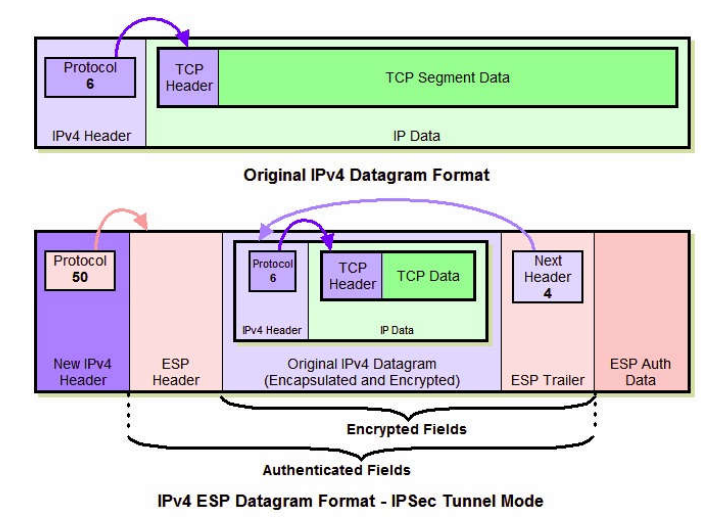
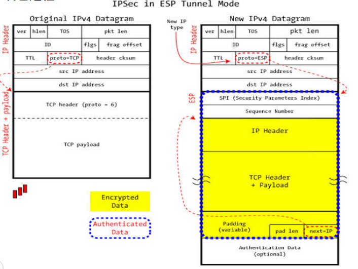
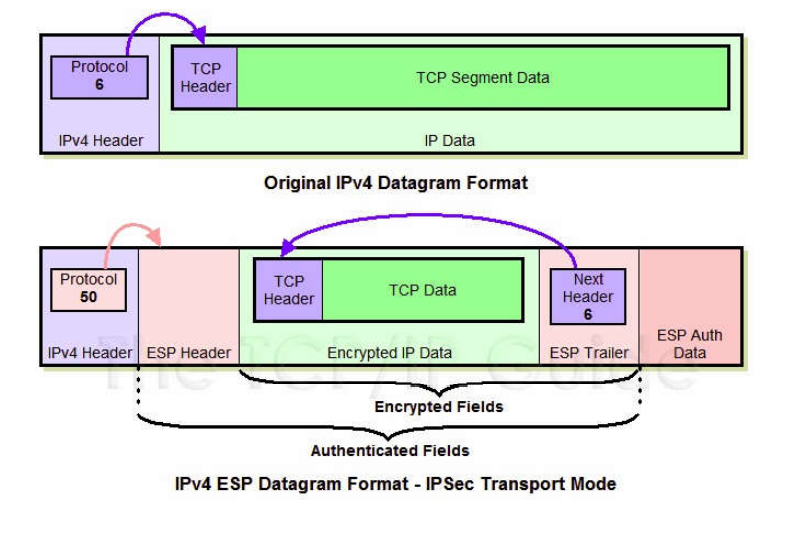
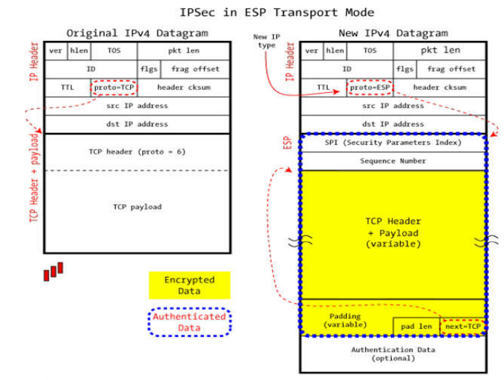

# IPSec 传输模式下 ESP 报文的装包与拆包过程

- 米家龙
- 计算机学院
- 18342075

[TOC]

## 什么是 IPsec

IPsec 在**网络层**将**每个 IP 分组**的内容先**加密再传输**，即使中途被截获，攻击者由于缺乏解密数据包所必要的**密钥**而无法获取其中内容。

## 加密方式

目前存在两种加密方式：

| 加密方式 |                                                         特点                                                         | 区别                                                                                                                 |
| :------: | :------------------------------------------------------------------------------------------------------------------: | -------------------------------------------------------------------------------------------------------------------- |
| 传输模式 |              只对 IP 协议报文的**有效数据载荷部分 (payload)**进行加密，因此需要对原始 IP 报文进行拆装。              | 原始 IP 报文被拆解，在其有效载荷前面**加上新的 ESP 或 AH 协议头**，再装回原来的 IP 地址，形成新的 IPsec 报文。       |
| 隧道模式 | **整个 IP 协议报文**进行加密，相当于把原始 IP 报文封装在一个**安全的隧道**进行传输，保持了原始 IP 报文的**完整性**。 | 原始 IP 报文作为数据内容，在这段“数据”前面**加上 ESP 或 AH 协议头**，再加上**新的 IP 头**，形成 IPsec 报文进行传输。 |

## 什么是 SA(Security Associations) 安全关联

- SA 可以理解为被 IPsec 保护的某个连接的唯一标示。SA 是单向的，即在一次安全的通信中，通信的两个方向 (发送和接收) 各需要创建一个 SA。
- 一个 SA 所包含的内容是维护一次安全通信所需要的数据参数。通常，一个 SA 可以由目的地址、IPsec 所采用的协议 (AH 或 ESP) 和 SPI 来唯一确定。

## 完整流程

### 装包过程

> 完整过程如下：

#### 1. 在原 IP 报文末尾添加 ESP trailer (尾部/挂载) 信息。

ESP trailer 包含三部分。由于所选加密算法可能是块加密，当最后一块长度不足时就需要填充 (padding)，附上填充长度 (Padlength) 方便解包时顺利找出用来填充的那一段数据。Nextheader 用来标明被封装的原报文的协议类型。如下图：

#### 2. 加密封装。

将原 IP 报文以及第 1 步得到的 ESP trailer 作为一个整体进行加密封装。具体的加密算法与密钥由 SA 给出。

#### 3. 为第 2 步得到的加密数据添加 ESP header。

ESP header 由 SPI 和 Seq# 两部分组成。加密数据与 ESP header 合称为 “Enchilada”，构成认证部分。注意到被封装的原报文的协议类型受到保护，由加密的 ESP trailer 的 Next header 声明，而不出现在未加密的 ESP header 中。

#### 4. 附加完整性度量结果 (ICV，Integrity check value)。

对第 3 步得到的 “enchilada” 部分做认证，得到一个 32 位整数倍的完整性度量值 (消息认证码 MAC)，并附在 ESP 报文的尾部。完整性度量算法包括需要的认证密钥由 SA 给出。

#### 5. 加上新的 IP header 构成 IPsec 报文。

新构造的 New IP header 附在 ESP 报文的前面组成一个新的 IP 报文。注意 New IP header 的 IP 地址由路由器和安全网关解释，可以和原报文 (由主机创建的 IP 地址) 不同。协议类型为 50，说明它封装的是一个 ESP 报文。

### 拆包流程

1. 接收方收到 IP 报文后，发现协议类型是 50，表明这是一个 ESP 包。首先查看 ESP header，通过 SPI 检索数据报文所对应的 SA ，读取对应的模式 (tunnel/transport mode) 以及安全规范。
2. 计算 “enchilada” 部分的摘要，与附在末尾的 ICV 做对比，验证数据完整性。
3. 检查 Seq# 里的顺序号，保证数据是“新鲜”的。
4. 根据 SA 所提供的加密算法和密钥，解密被加密过的数据，得到原 IP 报文与 ESP trailer。
5. 根据 ESP trailer 的填充长度信息，找出填充字段的长度，删去后得到原来的 IP 报文。
6. 最后根据得到的原 IP 报文的目的地址进行转发。

具体如下图：

