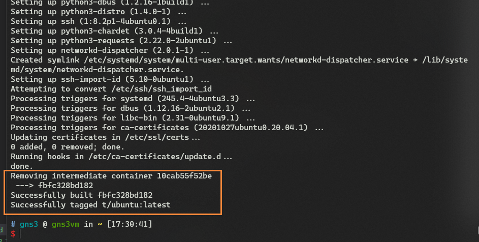
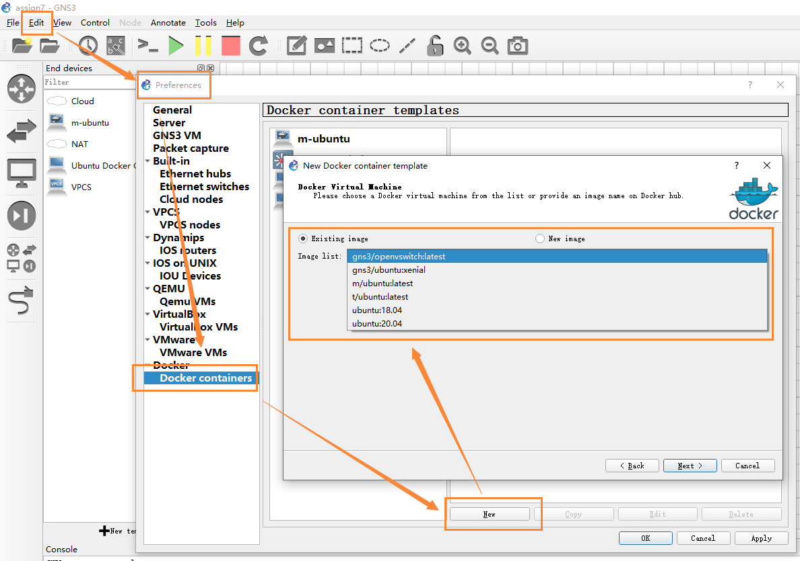

# 信息安全第七次作业相关摸索

- [信息安全第七次作业相关摸索](#信息安全第七次作业相关摸索)
  - [说明](#说明)
  - [配置 gns3](#配置-gns3)
  - [配置相关软件](#配置相关软件)
    - [1. 端口映射](#1-端口映射)
    - [2. 构建 docker](#2-构建-docker)
      - [1. 修改 dockerhub 源](#1-修改-dockerhub-源)
      - [2. 创建 Dockerfile 文件](#2-创建-dockerfile-文件)
      - [3. 构建容器](#3-构建容器)
      - [4. 导入到 gns3 中](#4-导入到-gns3-中)
    - [3. 其他](#3-其他)
      - [1. ubuntu docker 的相关配置文件](#1-ubuntu-docker-的相关配置文件)
      - [2. 两个路由器配置](#2-两个路由器配置)
      - [3. arpspoof 的使用](#3-arpspoof-的使用)
      - [4. tmux 的使用](#4-tmux-的使用)

## 说明

> 尝试使用 gns3 作为模拟软件来尝试完成第七次信息安全作业

相关软件下载可以在校园网下访问 [GNS3 相关](http://172.18.40.111:51314/GNS3%e7%9b%b8%e5%85%b3/) 下载必要的软件：

- gns3 本体
- gns3 虚拟机（我只下载了 vbox 的），如果用 vmware 或者 hyper-v 的请去 [官方下载地址](https://www.gns3.com/software/download-vm)下载对应的虚拟机，并且我不会对应的端口映射操作，所以需要你们自己去弄
- cisco 3640 路由器镜像文件
- cisco 7200 路由器镜像文件

视频：

<div style="position: relative; padding: 30% 45%;">
  <iframe style="position: absolute; width: 100%; height: 100%; left: 0; top: 0;" src="https://player.bilibili.com/player.html?aid=970802314&bvid=BV1wp4y1B7Lt&cid=271292359&page=1&as_wide=1&high_quality=1&danmaku=0" frameborder="no" scrolling="no" allowfullscreen="true"></iframe>
</div>

## 配置 gns3

1. 安装 gns3 （安装过程中 wireshark 和对应的虚拟机可以看自己需要是否下载，我这里是安装过了有现成的所以不用，剩余的东西都是之前安装过的 gns3 剩下的，所以不安装，你们自己取舍）。
2. 解压虚拟机压缩文件，导入到 vbox 中。
3. 在 gns3 中导入 cisco 的两个路由器镜像，具体操作自己谷歌一下，很简单的。

打开 gns3 看看能不能正常运行，不会 boom 就好。

> 导入虚拟机的时候会让你选择用多少个 cpu 和内存，**看你喜欢**。  
> 在一开始打开 gns3 的时候应该会让你导入虚拟机，但是如果跳过了，请在这个界面设置：  
> 

## 配置相关软件

### 1. 端口映射

在 vbox 处进行端口映射。这一步是为了能够使用 ssh 连接上虚拟机，不然在那个非常原始的界面操作非常考验人的耐心（如果你要愿意，那我没话说）。具体操作如下图，需要添加一个主机到子系统 **22 端口**的映射，我这边选择的是 `主机 55022 -> 子系统 22`：


使用 ssh 连接上虚拟机，默认的用户名和密码都是 `gns3`：

```bash
ssh gns3@127.0.0.1 -p 55022
```

进入之后会出现如下界面：


直接回车（**不支持鼠标的**），进入第二个 UI 界面，如图：


选择橙色框框的按个 `Shell` ，从而转到一个 shell ，之后的操作就和 ubuntu 18.04 的终端操作一样了，如下图：


> 在进入 shell 模式后，页面没有刷新，所以看着很难受，可以使用 `clear` 或者 `reset` 命令刷新一下。  
> 我这边是自己配了个 zsh ，所以之后就会使用 zsh 来替代原有的 bash ，但是操作都一样，所以没啥问题。  
> 

### 2. 构建 docker

> 为什么需要构建 docker ？
>
> 1. docker 是什么，自己查。我也没弄懂，但是能用就行。
> 2. gns3 支持使用虚拟机来模拟对应的硬件，比如说 cisco 3640 和 7200 都是路由器的二进制固件。
> 3. 如果使用完整的虚拟机的话，先不说 .iso 文件都要 2G 多，安装过程不得麻烦死（虽然但是，我没试过，我云的，我瞎猜的），太浪费时间了。而 docker 容器则是已经配置好对应的环境了，可以直接用。
> 4. gns3 虚拟机中已经配置好了 docker 相关软件了，因此我们只需要改一下 dockerHub 源和写一下 `Dockerfile` 就可以构建了。

#### 1. 修改 dockerhub 源

> 参考[docker 设置国内镜像源](https://blog.csdn.net/whatday/article/details/86770609)

修改 `/etc/docker/daemon.json` 文件为如下：

```json
{
  "registry-mirrors": ["https://docker.mirrors.ustc.edu.cn"]
}
```

> 冷知识：
>
> 1. 这个虚拟机应该是带有 nano 或者 vi 的，适应一下这种编辑器吧。
> 2. 使用其他客户端通过 ssh 连接虚拟机的好处之一：能够在主机复制黏贴到对应的终端。
> 3. 上面修改后的镜像源是中科大的。（比 matrix 的好，应该？）
> 4. 换源之后重启一下 docker （`sudo systemctl daemon-reload` 和 `sudo systemctl restart docker`）或者虚拟机，不然**可能**源还是原来的

#### 2. 创建 Dockerfile 文件

在用户根目录下创建 `Dockerfile` ：

```bash
cd ~/ && touch Dockerfile
```

在 Dockerfile 中写入如下：

```Dockerfile
FROM ubuntu:20.04
RUN echo 'start to build\n' \
# 设置镜像源为清华源
&& sed -i 's/archive.ubuntu.com/mirrors.tuna.tsinghua.edu.cn/g' /etc/apt/sources.list \
# 注释掉某些东西
&& sed -i 's/deb http:\/\/security/#/g' /etc/apt/sources.list \
# 设置自动更新
&& apt update \
# 安装 tcpdump ，用于代替 wireshark
&& apt-get install -y tcpdump \
# 安装 net-tools ，用于使用 ifconfig 命令
&& apt-get install -y net-tools \
# 安装 iproute2 ，用于使用 ip 命令（虽然好像确实没用到）
&& apt-get install -y iproute2 \
# 安装 iputils-ping ，用于使用 ping 命令
&& apt-get install -y iputils-ping \
# 安装 nmap 工具，虽然实际上可有可无
&& apt-get install -y nmap \
# 安装 dsniff 工具，用于使用 arpspoof 工具进行 arp 欺骗
&& apt-get install -y dsniff \
# 安装 driftnet 工具，可用于拦截并获取目标的消息，虽然实际上没用到
&& apt-get install -y driftnet \
# 安装 ssh nano 和 tmux
# 其中 tmux 是必须的！
# 因为攻击机需要使用两个终端，
# 但是使用两个 console 连接到攻击机，只会出现两个一模一样的终端
# 因此需要使用 tmux 来进行分屏操作
&& apt-get install -y ssh nano tmux
```

#### 3. 构建容器

使用如下命令构建容器：

```bash
# t/ubuntu 是容器名字，你可以自己取一个
# . 我不知道是啥意思
docker build -t t/ubuntu .
```

构建，然后开始等跑完，你可以趁这个时候摸一会儿 🐠：


如果遇到了类似如下的错误的话，尝试 build 几次就好，具体原因我也不清楚：


> 我这边是遇到了 4 次上面的错误才构建好了的。

构建成功：



#### 4. 导入到 gns3 中

> 自己搜一下 gns3 导入创建好的 docker ，很简单的。

参考如下图：



> 除了图中这个地方需要选择之外，其他地方基本可以无脑 `Next`。

### 3. 其他

> 上面的东西配置完之后，就是拖东西，配置东西

这里可能有你需要了解的一下东西：

#### 1. ubuntu docker 的相关配置文件

攻击机：

```conf
#
# This is a sample network config uncomment lines to configure the network
#


# Static config for eth0
auto eth0
iface eth0 inet static
	address 192.168.1.2
	netmask 255.255.255.0
	gateway 192.168.1.1
#	up echo nameserver 192.168.1.1 > /etc/resolv.conf

# DHCP config for eth0
# auto eth0
# iface eth0 inet dhcp
```

目标机：

```conf
#
# This is a sample network config uncomment lines to configure the network
#


# Static config for eth0
auto eth0
iface eth0 inet static
	address 192.168.1.64
	netmask 255.255.255.0
	gateway 192.168.1.1
#	up echo nameserver 192.168.0.1 > /etc/resolv.conf

# DHCP config for eth0
# auto eth0
# iface eth0 inet dhcp
```

#### 2. 两个路由器配置

> 命令都是在命令行界面用的

1. 3640，用于模拟交换机：

```bash
# 进入特权模式
conf t
no ip routing
```

2. 7200，用户模拟网关：

```bash
# 进入特权模式
conf t
# 进入对应端口，这个是你自己设置的
int fa0/0
# 设置对应的 ip 和掩码
ip addr 192.168.1.1 255.255.255.0
```

3. 保存配置。如果你担心路由器设备在关机之后配置丢失，那么需要如下命令将其**持久化保存**：

```bash
copy running-config start-config
# 一堆确认
write
```

#### 3. arpspoof 的使用

我只会这一个，就是用来对目标机进行 arp 欺骗攻击的

```bash
arpspoof -i eth0 -t 192.168.1.64 192.168.1.1
```

#### 4. tmux 的使用

> 为什么我不用 wireshark ？  
> 看图，我有啥办法，我要能用我早用了 😭😭😭  
> 

1. 使用 `tmux` 命令直接进入 tmux 模式；
2. `ctrl + b` + `%` 水平分屏；`ctrl + b` + `"` 垂直分屏
3. `ctrl + b` + `方向键` ，切换焦点窗口
